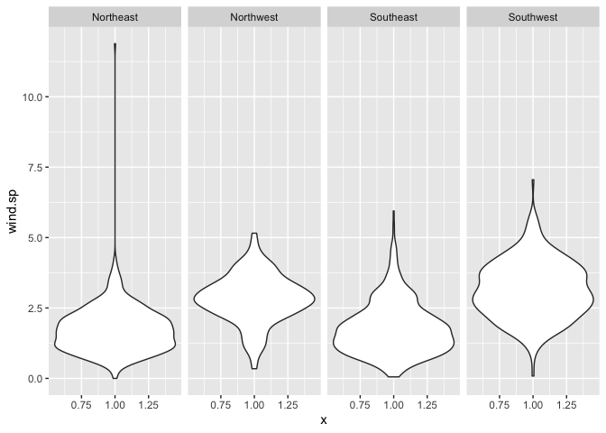
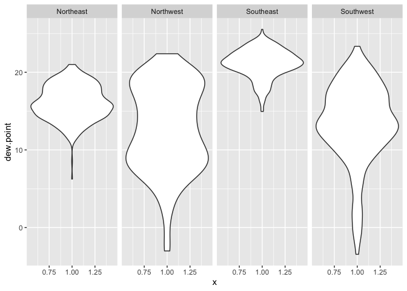
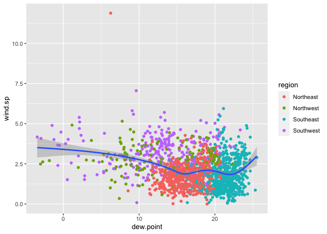
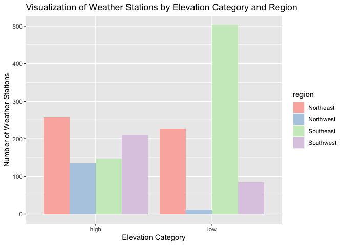
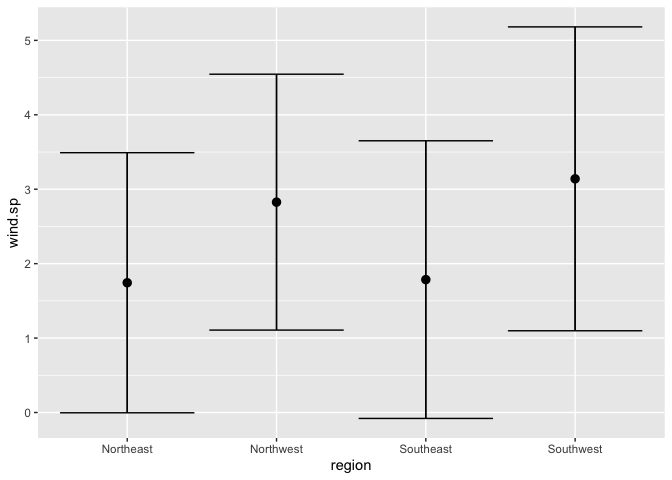
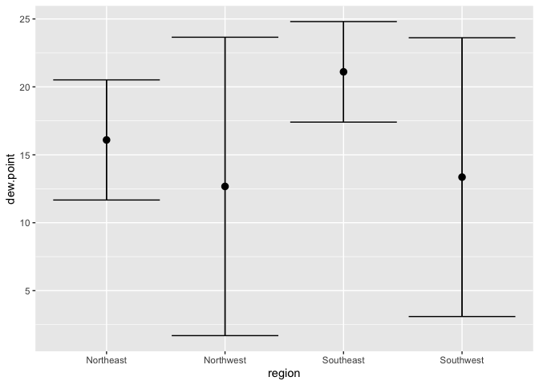

Lab 4
================
Sylvia Baeyens
9/17/2021

Objective= to examine the association between weekly average dew pt temp
& wind speed in 4 regions of the US

# 1. Read in the Data

``` r
#download file ONLY IF it has not been downloaded previously
if (!file.exists("../met_all.gz")) {
  download.file("https://raw.githubusercontent.com/USCbiostats/data-science-data/master/02_met/met_all.gz", "../met_all.gz", method="libcurl", timeout = 60)}
met <- data.table::fread("../met_all.gz")
```

# 2. Prepare the data

``` r
#Remove temperatures less than -17C
met = met[temp>-17]
#Make sure there are no missing data in the key variables coded as 9999, 999, etc
met[,table(is.na(temp))]
```

    ## 
    ##   FALSE 
    ## 2317204

``` r
met[,table(is.na(rh))]
```

    ## 
    ##   FALSE    TRUE 
    ## 2310917    6287

``` r
met[,table(is.na(wind.sp))]
```

    ## 
    ##   FALSE    TRUE 
    ## 2285461   31743

``` r
met[,table(is.na(vis.dist))]
```

    ## 
    ##   FALSE    TRUE 
    ## 2283538   33666

``` r
met[,table(is.na(dew.point))]
```

    ## 
    ##   FALSE    TRUE 
    ## 2310917    6287

``` r
met[,table(is.na(lat))]
```

    ## 
    ##   FALSE 
    ## 2317204

``` r
met[,table(is.na(lon))]
```

    ## 
    ##   FALSE 
    ## 2317204

``` r
met[,table(is.na(elev))]
```

    ## 
    ##   FALSE 
    ## 2317204

``` r
met[elev == 9999.0, elev := NA]

#Generate a date variable using the functions as.Date() (hint: You will need the following to create a date paste(year, month, day, sep = "-")).
met[, ymd := as.Date(paste(year, month, day, sep = "-"))]
#Using the data.table::week function, keep the observations of the first week of the month.
met[, table(week(ymd))]
```

    ## 
    ##     31     32     33     34     35 
    ## 297259 521600 527922 523847 446576

``` r
met = met[week(ymd) == 31]
#Compute the mean by station of the variables temp, rh, wind.sp, vis.dist, dew.point, lat, lon, and elev.
met_avg = met[,.(
  temp = mean(temp,na.rm = TRUE),
  rh = mean(rh,na.rm = TRUE),
  wind.sp = mean(wind.sp,na.rm = TRUE),
  vis.dist = mean(vis.dist,na.rm = TRUE),
  dew.point = mean(dew.point,na.rm = TRUE),
  lat = mean(lat,na.rm = TRUE),
  lon = mean(lon,na.rm = TRUE),
  elev = mean(elev,na.rm = TRUE)
),by = "USAFID"]
#Create a region variable for NW, SW, NE, SE based on lon = -98.00 and lat = 39.71 degrees
met_avg[lat>= 39.71 & lon<= -98,region:="Northwest"]
met_avg[lat< 39.71 & lon<= -98,region:="Southwest"]
met_avg[lat>= 39.71 & lon> -98,region:="Northeast"]
met_avg[lat< 39.71 & lon> -98,region:="Southeast"]

met_avg[,table(region, useNA="always")]
```

    ## region
    ## Northeast Northwest Southeast Southwest      <NA> 
    ##       484       146       649       296         0

``` r
#Create a categorical variable for elevation as in the lecture slides
met_avg[, elev_cat:=fifelse(elev>252,"high","low")]
```

# 3. Using geom\_violin to examine wind speed & dew pt temp

``` r
ggplot(met_avg, mapping = aes(y= wind.sp, x=1)) +
  geom_violin() +
  facet_grid(~region)
```

    ## Warning: Removed 15 rows containing non-finite values (stat_ydensity).

<!-- -->

``` r
ggplot(met_avg, mapping = aes(y= dew.point, x=1)) +
  geom_violin() +
  facet_grid(~region)
```

<!-- --> The northeast
has the greatest range of wind speed values. However, the average wind
speed is larger in both western regions. The average dewpoint temp is
greatest in the southeast region. There is a greater range of dewpoint
temp values in both western regions.

# 4. Using geom\_jitter with stat\_smooth between dew pt & wind speed

``` r
ggplot(met_avg, aes(y=wind.sp, x=dew.point)) +
  geom_jitter(aes(color=region)) +
  stat_smooth()
```

    ## `geom_smooth()` using method = 'gam' and formula 'y ~ s(x, bs = "cs")'

    ## Warning: Removed 15 rows containing non-finite values (stat_smooth).

    ## Warning: Removed 15 rows containing missing values (geom_point).

<!-- --> There is a
slight negative relationship between dew point and wind speed, except
for at the highest dew point temperatures. This graph also confirms that
the South east has the highest dew point temperature values.

# 5. Using geom\_bar

``` r
met_avg[] %>%
  ggplot() +
    geom_bar(mapping = aes(x=elev, fill=region, position = "dodge")) 
```

    ## Warning: Ignoring unknown aesthetics: position

<!-- -->

# 6. Using stat\_summary to examine mean dew point and wind speed

``` r
ggplot(met_avg[!is.na(wind.sp) & !is.na(dew.point)], 
       mapping=aes(x=region, y= wind.sp)) +
    stat_summary(fun.data = "mean_sdl") +
    stat_summary(fun.data = "mean_sdl", geom= "errorbar")
```

<!-- -->

``` r
ggplot(met_avg[!is.na(wind.sp) & !is.na(dew.point)], 
       mapping=aes(x=region, y= dew.point)) +
    stat_summary(fun.data = "mean_sdl") +
    stat_summary(fun.data = "mean_sdl", geom= "errorbar")
```

<!-- --> Dew point
temperature is the temperature at which the air cannot hold any more
water in gas form.

Wind speed is the max speed at which the wind flows as measured by the
weather stations. In the northwest and the southwest, the average max
wind speed is 3 mph (kmph?) whereas it’s close to 2 mph in the northeast
and southeast.

# 7. Making a map!

``` r
temp.pal = colorNumeric(c('darkgreen','goldenrod','brown'), domain = met_avg$rh)


leaflet(met_avg) %>%
  addProviderTiles('CartoDB.Positron') %>%
  addCircles(
    lat = ~lat, lng=~lon,
                                                  # HERE IS OUR PAL!
    label = ~paste0(round(rh,2), ' rh'), color = ~ temp.pal(rh),
    opacity = 1, fillOpacity = 1, radius = 500
    ) %>%
  # And a pretty legend
  addLegend('bottomleft', pal=temp.pal, values=met_avg$rh,
          title='Temperature, C', opacity=1)
```

<div id="htmlwidget-d1d8e4c0df3a1f355b19" style="width:672px;height:480px;" class="leaflet html-widget"></div>
<script type="application/json" data-for="htmlwidget-d1d8e4c0df3a1f355b19">{"x":{"options":{"crs":{"crsClass":"L.CRS.EPSG3857","code":null,"proj4def":null,"projectedBounds":null,"options":{}}},"calls":[{"method":"addProviderTiles","args":["CartoDB.Positron",null,null,{"errorTileUrl":"","noWrap":false,"detectRetina":false}]},{"method":"addCircles","args":[[34.2999166666667,30.7839999999999,42.5429999999998,32.2174556213017,41.4249999999999,30.3829999999999,38.583,37.1859999999998,34.5450000000001,33.636,40.7469999999999,46.417,45.4169999999999,46.6829148936174,31.397,46.6190000000001,33.175,34.1000000000002,32.9150000000001,41.2749999999998,38.9549999999999,27.2070000000001,32.2129999999999,48.4670555555557,28.973,34.2729999999999,41.7360000000003,26.442,35.256,36.6869999999999,34.6020000000001,36.018,43.6769999999998,42.5740489130436,37.5210000000001,32.4440000000001,33.7139999999999,36.361013888889,33.53,32.747,42.4530034843205,33.7799859649123,32.084,30.8860000000002,37.2389999999997,31.8689999999999,32.4560000000001,32.6459965277778,30.8720000000001,40.1000000000002,33.254,38.96,34.8610000000001,41.1959999999999,40.9470000000001,33.0959999999997,41.3999999999998,35.6130833333333,31.78,36.4139895833334,27.7790000000002,38.3979999999999,33.1100486111111,39.0159999999998,32.354,45.6540000000003,48.2990069444448,30.2430000000002,40.4350000000002,42.2189999999998,44.8919999999999,39,38.607,33.898,39.1670344827586,32.1491272727273,44.6259243697481,35.8639999999998,44.3330000000001,42.732,42.7959722222224,30.750012345679,33.598,33.1540000000003,41.2260000000001,36.6110000000001,34.699,39.6000627615065,35.5379999999998,35.95,35.4729375,31.0429927536232,31.846,42.0699999999999,45.3719999999997,43.9870000000001,43.743,41.9599999999996,27.9160000000001,34.229,35.6334545454545,41.0326610169491,36.8549999999998,30.2910000000001,30.7036423357665,38.967,39.7999649122806,45.1169999999999,47.1039166666665,31.0559999999999,34.8500000000002,34.0999999999999,28.9499999999999,39.217,35.6000000000002,33.8500000000002,41.4120868055557,38.1499999999998,39.9280555555555,39.9830000000001,36.4219789915965,41.828,34.2669999999999,40.3330000000001,43.4330000000004,39.4279999999999,37.158,37.4500000000001,39.7669583333332,36.6650000000002,37.578,37.6329999999999,38.0669684210524,37.7510000000002,30.8169479166666,30.5580000000001,36.8999999999998,46.2170279720281,44.5669999999997,44.883578313253,44.9330000000003,37.4000000000001,36.7829999999999,37.8500000000002,33.902,41.824,41.4440347222222,43.5480000000001,38.6980000000002,38.2388765432097,38.783,38.533,40.0330208333333,40.3329999999999,40.5670138888886,40.167,37.283,34.3829999999999,30.5,41.3000729166665,40.6168541666668,41.384,39.1833437500002,35.4329930555557,36.1748333333333,41.5519999999998,40.0310000000002,38.533,32.1499999999998,32.7170277777777,40.6170000000001,26.9669999999999,42.6830000000003,29.9759999999999,44.7829999999999,30.4600208333333,41.3330000000001,29.7169999999999,34.3,34.5,33.1830000000001,34.783,33.649982394366,33.2500286738351,34.283,33.717,34.717,32.7009999999999,34.7170629370629,34.1809999999999,32.9170139372823,34,32.41187456446,33.8280106007068,38.9089999999998,38.0329893992933,36.5330000000001,29.8000000000001,44.0159999999997,36.75,35.8829999999999,35.283,35.4830000000001,43.6630000000001,34.6170174825176,33.0630000000001,34.3999999999998,34.3149999999999,35.3,38.3500252707583,29.5000208333333,44.0949999999998,30.5330000000001,43.2350000000001,33.417020979021,38.717074204947,37.5130000000002,31.1059999999999,30.3950000000002,36.3299999999999,40.2250000000002,38.355888888889,28.8670000000001,30.7349999999999,31.5540000000001,29.467,33.632986111111,39.6080000000001,41.0519999999998,40.2039999999999,33.9120000000001,29.1170000000001,28.6430243902439,28.0556443661972,28.5,43.5810000000001,30.3490782608696,41.0660000000001,47.4509999999997,30.902,32.646,35.9470000000001,34.8167985611511,36.6540000000003,33.4330000000001,31.8410000000002,31.6409999999998,32.3040000000001,39.6670277777777,38.9459999999999,48.884,46.9249999999998,48.7839999999998,34.6890000000002,48.4799999999997,44.2510000000002,48.9290000000001,48.3809999999998,35.9369999999999,48.4050000000002,47.2900000000003,48.3899999999998,47.7960000000002,46.768,46.1170000000002,43.0669999999996,29.067,48.3009999999999,46.9419722222219,27.8329999999998,27.6300520833334,29.2960000000001,48.7260000000002,34.9150000000001,30.0709999999999,40.2800000000001,45.5059999999999,31.6059999999999,46.2180000000002,41.2330277777779,32.521,40.3677418111751,30.6170000000001,32.1100138888888,37.9740000000001,32.6090000000002,26.9331041666667,29.1170416666668,40.7109999999998,32.2139999999999,30.0329999999999,32.4328762886598,33.227,30.7179999999999,35.7,42.5169999999999,35.1779999999999,35.3799999999999,31.6840000000001,30.879,31.8850000000002,43.4670000000001,28.2280000000001,32.9309999999999,39.3320000000001,30.1729999999999,29.634,44.4764497607655,46.2440000000001,43.6209936507934,43.4590000000003,27.8119999999999,24.5556802325581,28.29,28.4740000000001,24.582893939394,24.7260000000001,25.7813551912568,28.0140000000001,26.378,25.9070000000001,25.4831456310681,25.6480000000001,26.6847902097902,34.2690000000001,44.0739663299664,44.7530000000003,26.9169999999999,25.9990268456375,26.1549586206897,26.197,28.1010243902439,29.4449999999999,32.7420000000001,34.8040000000001,28.516966101695,26.2499805194805,28.4338219178083,34.3979999999999,36.7729999999999,28.545,35.1350000000001,29.167,28.7800000000001,42.6900105263158,30.4927005988023,39.4670729166667,31.4770209059233,30.2330545454546,30.399918918919,30.219,30.4000000000001,32.1312285714286,35.096003472222,34.976,38.0889999999999,41.9320000000001,40.2000000000001,34.4709999999997,35.7810000000001,32.8992206896552,39.4170282485877,42.2459999999998,32.4829548872181,40.9331041666669,31.8831948051947,36.2939756944444,36.6050489510487,44.6800000000001,32.6989999999999,36.6819999999999,35.9765833333334,41.5840000000002,40.9599999999998,35.7240000000001,37.4500000000001,27.498,27.765,26.5850117647059,32.675,26.536,34.3168229166665,27.9629554140128,32.6989999999999,30.1689999999999,45.1590656249998,27.400744680851,27.911,27.0720000000001,27.9999329268293,29.634052631579,32.693,27.9499345794391,40.1490104166666,43.4330000000004,41.5399826388891,41.1209999999998,35.4830000000001,46.8389999999999,31.25,35.5409999999999,35.389923566879,35.4380000000001,32.1930000000001,31.259,31.152,30.368,30.3997086614173,36.0229999999999,44.5230000000001,32.5789999999999,45.2363672456579,45.4259999999998,31.0829999999999,35.417,41.3520000000002,41.35,36.4371666666666,34.722,39.2170416666667,34.123,40.5200000000003,26.1790000000001,31.5360000000001,35.6679999999998,34.979,30.7829999999999,38.2469999999999,44.7790000000003,31.382986111111,32.6877403314918,40.9240000000003,39.7000000000001,34.167,32.6329999999999,33.3119999999999,35.1949999999999,35.0210104166667,45.1499720279718,33.3643461538461,33.467,41.893,45.8230000000002,34.2720268456375,35.3570034722222,35.2119369369369,27.1819999999999,33.6322666666667,33.9290000000001,32.473,36.2849999999999,40.2929999999998,33.7790000000001,33.8750135135135,33.3550437956204,36.2000000000001,35.9290000000001,29.7329333333334,35.5820000000002,29.2110000000001,38.4830000000001,42.0460000000002,28.6540000000002,30.4830000000001,41.9639999999999,29.9589999999999,28.8210242424242,35.8580000000001,30.7800000000001,32.5640000000001,38.5330415224913,41.0370069444446,30.478,30.3501249999999,30.7171068702291,30.6874405594406,31.666,30.6260175438597,31.3500000000001,31.356,42.2420000000002,34.8909999999998,38.9809999999999,30.6500000000001,40.6239999999999,30.1310000000001,39.5310000000002,32.3500000000001,32.514,44.7293663366334,32.756,32.516,42.0980416666666,32.3000000000001,27.266986111111,32.3829999999999,31.8609859154929,31.317,31.2670535714285,33.9169124087591,40.6839999999999,31.3090000000001,31.4160000000001,34.6529999999999,33.5659732142856,32.6159923076923,33.9670454545455,33.2120000000001,33.587,40.9480000000002,33.1779999999999,29.9954113475177,30.5210173611111,30.038,30.049,29.81732,31.736,30.5369322033898,37.033,31.4170000000001,32.0360000000001,29.7168396946566,30.3430175438596,42.4709405204458,45.4689999999997,38.0970520833332,30.8329999999999,27.3490000000001,32.3348085106383,29.2961754385965,42.3510000000002,32.5500000000001,42.9920760869568,31.467,32.3201048951048,29.2657083333332,32.337,32.2330209790211,31.6168560000001,31.1829032258064,29.0540882352941,33.1670000000001,29.9470000000001,34.6809999999998,38.783,35.55,27.9170000000002,31.0496846846847,30.1267534246575,29.5619999999999,30.210025477707,30.205,29.566052631579,29.9508814814815,29.7089607843137,29.273,29.5189639639639,30.0679393939395,29.9783247863248,29.616156626506,29.638067961165,30.3569489795918,31.236,30.744,32.3539999999999,32.0309411764705,32.3849895833334,32.6640000000001,32.44775,32.543,32.5,32.5158230088496,31.3950000000001,32.3499999999999,32.7099814814815,31.578,26.228,26.184,26.166,27.775252173913,27.6830970873786,27.5000714285714,27.741,27.9001129032258,27.5331145833333,29.339,28.0840526315789,28.457,29.11,29.5411384615384,29.36,29.3830660377358,29.5329433962264,29.9830000000001,29.8910576923077,30.1992782608696,33.19,30.74094,29.622,30.3209900990099,30.679,28.8597246376811,33.6509999999999,28.7249999999999,31.6186551724138,31.485,31.1338793103448,31.0830576923077,31.067,31.1500594059407,32.8519038461538,33.6330350877192,33.068,33.2059572649573,32.898463768116,32.5649999999999,32.973,32.7670208333333,32.782,32.969,32.681,32.2150000000001,29.3763571428572,29.36675,30.0479374999999,30.9121237113402,31.8309896907217,31.3540338983051,35.8999826388887,30.3710000000001,31.921,31.9482831858407,31.7800000000001,32.4118421052632,31.7999581881534,33.663754385965,32.8529999999999,35.003,36.7410157480315,33.3067719298246,33.4500909090909,34.3837142857142,32.3340297029703,32.6927905759164,34.43244,32.2,38.5859479166665,32.8400000000001,32.2830416666667,31.8084571428572,33.2365151515152,31.4580000000001,32.6329999999999,32.2620000000001,31.4209752066115,31.5879685534591,32.1443793103448,32.1669903846153,32.855,32.9503608247422,33.269,35.658,33.4287666666666,33.4668823529412,33.688,33.5489285714286,33.3005294117648,33.5273272727273,33.4171904761904,33.623,32.817,31.607,31.3997321428572,31.0226554621848,48.9410000000002,33.8998020833334,33.8222474226805,33.9520000000001,34.023747368421,34.201,34.016,34.21,34.0992727272727,34.6669939759037,35.2370000000001,33.9749999999999,32.7338823529412,32.8159999999999,32.5720000000001,32.826,32.567,33.023,33.3000701754387,33.128,33.2860000000001,32.8670223880598,33.219,33.9373798449613,35.0668586572437,33.8029285714285,33.9229999999999,33.8126666666666,39.163,33.79,33.8719999999999,33.6799674796747,35.7420000000001,34.2678106508876,35.173985645933,35.0331105990785,34.991,34.7330076923078,35.9170072727273,35.765,35.889037037037,35.6330138888887,35.3438203592815,35.3175798816568,35.855,34.833,36.261,36.0280173010382,36.817,36.298,36.9023766233766,36.6980000000002,37.7080084745763,36.9369999999999,37.1319999999999,37.1329999999999,34.9000066666666,35.0680000000001,34.708,34.6831567164179,38.527,33.9430158730159,33.9709661016949,33.96628125,34.1879610389611,33.5870000000001,34.792,33.9482191780822,38.0100000000002,33.462,34.4652608695652,34.9870136054422,34.6719999999999,34.8460434782608,34.8871801242236,34.7579999999999,46.1499999999998,34.2489999999999,35.2330000000001,35.2226000000001,35.2370000000001,35.4279999999999,36.432,35.1970000000001,35.8209999999999,35.432110091743,35.6460000000001,31.5360000000001,36.223,36.0940331125828,34.9880599999999,36.047,36.4599999999998,34.498,36.134,35.0170136054421,34.3482875816993,34.6445774647887,34.6790000000001,34.744032,35.0338897058824,35.5540000000001,35.951,35.8177837837839,36.1432251655629,36.009,36.056,36.623947368421,35.350422818792,37.2249999999999,36.773,33.6499999999999,33.4499999999999,34.262688,35.054693877551,35.5930603448275,36,36.4799596774193,34.7270208333333,34.9170208333333,36.125,35.8310097087379,35.9668421052631,35.94,34.29,34.5999999999999,34.1799285714285,33.454,33.221,33.6170208333335,35.2579999999999,36.1674029850746,34.5470285714284,36.2829820359282,36.369,35.3329999999999,41.7299826388886,36.1909999999999,36.3498195488722,36.0100000000001,36.2910000000001,35.726,36.372,36.2669626865671,36.8780000000001,37.152,33.9774833333333,34.6500000000001,34.989,35.357,34.344,35.3876086956522,36.3329999999999,36.3829772727272,35.8519459459459,35.4169813084112,35.5340000000001,36.162,34.6500000000001,34.3000114285715,35.6570000000001,36.1991059602648,36.0390000000001,36.768,34.882,35.2499542857143,34.558,36.449081300813,34.0669999999999,35.1650000000001,36.399,35.5139743589744,31.1780104166666,30.0690000000002,35.2269185185185,35.6951212121213,35.1450000000001,35.0402439024391,35.8829270833332,35.6170000000001,36.744,34.427,36.450366972477,35.18201010101,35.654,35.2592564102563,36.9269911504424,34.6520163934427,35.0264590163934,34.2569999999998,34.2640068728522,35.1422518518518,34.518,34.8499588014983,45.4969999999999,33.9089999999998,30.5159756944443,34.607,35.9459999999999,35.1570000000001,34.768,34.9013333333334,34.8539999999999,34.741,34.6289999999999,34.7448571428572,35.4338571428572,36.0735462184875,36.6204159292036,36.7780714285715,37.6329374999999,36.3170416666667,36.319,34.1170196078432,34.426,34.2169696969697,34.201,34.7170000000001,34.8990800000001,35.6700000000001,38.341,40.1959749999999,36.6659999999999,36.682,37.5103252032521,37.183,38.1370680272109,37.3580000000001,36.9830000000001,37.9365294117646,37.6470000000002,38.9412047244095,38.2669999999999,38.5039826086956,38.7209999999999,38.7169814814815,38.2998823529413,38.8040000000001,38.8477260273973,39.143,39.078,36.8950000000003,39.4716470588235,36.6830555555558,39.1743124999999,39.7060327868853,39.3326956521738,39.4517664233578,39.9409999999999,39.3660142857143,41.009,39.8743223140495,40.183,40.0790000000001,39.1329999999999,40.033,38.6899999999999,40.8760000000001,40.277,40.0169906542055,40.7999636363637,37.3222972972972,38.2639999999999,36.573,36.7659999999998,37.317132231405,37.208,37.9500037593985,37.1330555555554,36.988,36.6880000000001,37.7839315068493,37.2979999999999,37.8670000000001,38.376387755102,38.8848644067798,39.2960060606061,39.643,39.4039365079366,39.674,37.5909927007299,40.820030612245,39.0448938053097,38.0398571428572,38.1815,38.1849375,38.228,37.75,37.8001649484537,37.9000578512397,37.086962962963,38.3654024390243,36.0229508196722,39.3400000000001,40.1759863945579,39.5939489795919,39.9923982300885,39.9000103626942,39.8169999999997,39.944,41.5630625000001,40.0780204081632,39.89621875,39.756,39.8400000000001,39.4309724770642,39.103,40.7080000000001,41.038,38.0447946428571,38.6499999999998,38.323,37.7800000000001,38.5499479166667,37.7500260416667,38.7525178571429,38.6570000000001,37.057408,37.0539965277779,39.578,39.2669253731343,38.2489999999999,39.4520000000001,39.1331354166666,39.72675,39.8249999999999,40.1169600000001,40.4119999999999,40.5279999999999,41.5329339622641,39.8449999999999,38.8833333333332,40.4830000000001,37.2392328767122,38.1319479166667,39.9371249999999,38.8170234375,38.7040000000001,37.761,40.097,37.7499285714286,38.5909999999999,38.096,39.2938671328671,39.1210000000001,39.823,38.7171274509805,38.8499672131147,38.8320000000001,39.7739423076922,37.6482176870749,37.1680060240963,37.7460258064517,37.6170177304966,38.0649999999999,37.6699878787879,39.0080361445782,38.0675683453239,37.7650256410256,37.927,37.0500000000001,38.349955882353,38.8495912408759,37.0910559006212,37.2839583333334,36.7369056603774,39.0500000000001,39.1350379746837,38.3290193548387,39.0724845360826,38.9499999999999,39.5509120879122,38.8760000000001,38.8000000000001,37,37.438232,37.1429756097561,37.9500555555556,38.0490103092783,38.0700000000001,38.2890655737705,37.2619736842106,37.282969387755,39.3670250000001,39.376024390244,38.81,39.2749834710744,39.5700000000001,39.2289999999999,40.0441,39.6494455445545,39.23,38.533,40.5169999999999,38.6779999999999,39.2449999999999,39.7840706521738,39.7170000000001,40.1670000000001,39.9007005988023,39.6089999999999,28.817,38.4261184573001,37.0999999999999,37.7087913043478,37.7060000000001,39.1311379310345,38.506,37.3069999999999,40.4360000000001,40.4500606060605,39.6009896907217,38.75,41.7870833333332,38.4169999999999,37.3704285714286,37.3827125748502,37.285,38.3779791666667,38.507065934066,38.5662207792208,38.6670421052631,39.1330566037735,39.1019583333333,38.6959687499999,36.212,38.051,39.2957391304348,39.4862857142857,39.4169999999999,36.5879946236559,37.8905714285715,37.6240416666666,37.6930000000001,37.721,37.4667272727273,37.5168275862069,37.6196335877862,37.359,37.333,37.9919791666667,38.21,38.5040806451612,39.7997674418606,37.0640000000002,42.5709999999999,41.073,41.509,40.8220000000001,40.685203125,33.8610000000001,40.85,41.5100000000001,41.4828655462186,40.7799618320612,41.6260000000001,41.067,41.5,41.1592631578947,41.264,41.3280163934427,40.7790188679246,41.9209999999999,42.4699999999999,41.2527125748502,41.650275862069,41.9099716981132,41.6760000000001,41.393,41.6689999999999,41.8760000000001,41.6880000000001,41.7244159292035,42.0720000000001,41.597,42.69698630137,41.533,41.9373103448277,41.7420000000001,42.5699999999999,41.3710247933885,41.7360280373831,42.5839999999999,42.362546875,42.1909999999999,42.2710000000001,40.3731417322834,41.6260000000001,40.8209999999999,42.552,40.2380535714285,40.3300280373831,39.9179999999999,40.1200135135134,40.1330175438595,40.217,41.0470121951218,40.777,41.1790000000001,40.296,40.3159999999999,40.8499723756907,41.3338120805368,41.2437417218544,40.433,41.7010438596491,43.35,42.2062222222223,42.4836095238096,42.159,42.1090000000001,43.5330000000001,40.6500149253731,36.695,40.6329860627176,42.7348620689656,43.1123913043478,42.643,43.234,40.4928167938931,40.7680340136053,40.3549850746268,40.2827784810127,40.616,40.9178571428571,41.3459591836735,40.873,39.364,43.3379999999999,40.472,40.0230701754387,41.40884375,41.518,41.5669220779221,41.2566859504133,41.2170000000001,41.3380000000001,41.7779999999999,34.5939999999999,42.0804210526315,41.8000000000001,41.3829673202613,42.9391037037036,42.241,43.1079900000001,43.1170000000001,41.7169720279721,35.0170277777776,41.9656696428572,41.9139375000001,38.5709999999999,40.04,39.8340312499999,39.478,40.6676899224806,41.743,41.453,40.9739291338582,40.6499099099099,40.234,41.6169797297298,41.7855714285715,38.764,41.5,42.417,41.6039999999999,41.7084285714286,41.717,41.5864482758621,41.014,42.2275912408759,42.0990000000001,42.223,42.409,42.2331000000001,42.6080000000001,42.629072916667,41.8166344086018,42.9110000000001,44.0219583333333,47.46703125,42.7747142857142,42.7460000000001,42.2668653846153,42.308,41.868,43.3220000000001,43.7800000000002,45.0129999999999,45.9823725490198,41.9210000000002,41.9330000000004,42.2510000000002,43.717457894737,42.5660000000003,41.9400000000001,40.7829999999999,43.6219999999998,42.1940178571429,41.139,41.4628571428572,41.8829999999999,41.4069999999998,41.2759999999999,40.4599999999998,43.078,42.7420000000002,41.5338584070797,42.111,41.6329999999999,43.0730000000002,41.6740000000003,41.1080000000001,41.6910000000001,40.7510034965037,42.0460000000002,41.0190104529618,42.3983571428572,41.9910671641791,41.8328541666667,41.0073902439022,42.2239720279722,43.2750174216026,41.9860000000002,42.4360070175437,40.7219999999999,42.5534285714286,40.6589999999998,42.7780000000001,43.1540338983052,42.0490069930073,41.3670104166668,42.681,42.5500198019803,41.2990000000003,41.0100034843207,43.2079999999999,42.5969999999999,41.259,41.7000105263159,40.6309905660377,41.3085714285714,40.8508947368421,40.8940208333334,40.893,38.1419999999999,40.301,40.9615309278351,41.6229999999998,40.6010245398772,40.7323142857144,41.764,40.0799999999999,41.1170000000001,40.6059999999999,41.433,42.5770208333332,41.9856999999999,41.449,41.4331013513513,42.4699999999998,42.3931428571428,41.0990000000001,41.1202426035504,41.1190000000001,40.7890000000002,40.2060000000001,40.50998540146,40.4500625000001,42.0569496855344,42.8370085470086,41.1569923664122,41.316953271028,39.8404466666666,41.8706081081082,41.1889965156796,42.8784624277456,42.7959999999999,42.9009821428572,40.4947538461539,40.4430000000001,40.4796875,39.5279583333332,40.7792121212121,40.219,41.5949999999999,41.1959999999999,41.1176562500001,42.815,42.061,41.2730377358491,43.6000538461539,42.9196190476191,46.1439583333333,43.5189599999999,40.0680000000001,40.7208217821782,40.8290000000001,40.9016782608696,40.6117743055554,39.2769583333334,39.3199587628865,38.898,37.654,44.889,43.500125,42.482,42.5420202020202,42.147,39.1260000000001,40.1516964285715,40.5154285714286,36.664,40.9780000000001,41.78,41.781,41.3330000000001,41.491,42.3772265625001,42.6,42.1664999999999,42.0739999999999,43.2041351351351,43.0829065420561,43.2779999999999,43.6439692307691,43.394,44.7984499999999,44.533,44.4499999999999,44.067,47.2860000000001,44.5340155038759,43.344,43.6260000000001,44.27,44.42,44.204,43.567,44.5759999999999,42.805,44.3680000000001,42.8999999999999,42.8939591836735,44.4678253968253,43.991,44.0500000000001,44.3159999999999,45.462,45.6480000000001,44.936,44.6500208333334,43.9888899082568,44.3850000000001,46.3502985074628,42.8829538461537,42.1260173913045,42.235,41.703,43.1704285714286,43.9629999999998,42.9669915966386,42.6650303030303,43.533,44.359577777778,44.2822452830187,44.2670349650349,44.741,45.0708732394367,38.7801795774649,39.4302195121953,46.3109999999998,44.4500989010992,39.0499999999999,42.9541578947368,45.9279999999999,43.109053475936,43.0410000000001,43.1399841269841,43.4170526315789,42.6149999999998,42.6171111111112,43.2120000000001,45.1010000000001,45.3080139860143,46.549,42.761,43.7690173913043,44.5499999999998,46.689010526316,43.8789999999999,44.8670000000001,43.933,43.9670000000001,43.156,43.9059642857143,43.0190000000001,45.1990000000001,44.4838,44.3590175438597,44.1329999999999,43.984,44.2655649350648,44.85,44.9290000000001,43.1669999999999,44.7825987654322,45.2280579710142,45.4189999999999,45.7090000000002,45.7324166666668,45.1174464285715,41.0529999999999,43.4011874999999,43.1640000000001,44.6139999999997,43.5220000000003,45.9320000000002,42.5950338983051,43.769,42.8870000000001,46.0259999999999,43.4259999999999,43.5786896551725,43.7330000000001,44.3001010101011,44.0510000000001,43.021,43.3909012345678,45.6689793814433,42.8803669064747,43.7669965277776,45.0320000000001,44.3954864864865,48.0159999999997,43.7740000000001,44.905,45.6440000000002,48.9410000000002,47.8220000000001,45.543,44.9689999999997,46.4049457364341,44.5479999999999,45.8679215686275,46.7028088235295,44.4500729166666,44.381024390244,46.4472977667495,44.628,44.5889999999999,45.5660000000002,43.9830000000001,44.3191214285712,44.123,44.8590987654324,46.2830860759491,44.6379916666666,45.0619999999999,45.1498888888887,45.9491012345681,44.831898989899,44.8829999999999,45.1421948051952,44.9319999999999,44.2171132075472,43.6495625000001,43.645,44.0770000000001,43.6828710601723,45.4437814569538,43.6499999999998,44.018,44.857,44.4829790209792,44.0434046242774,44.1499999999998,45.1540000000003,45.6039591836734,44.3389999999999,44.381,44.7687419354838,44.5439166666666,43.9659999999999,44.5169999999999,47.1329999999999,45.6980000000002,45.5599999999998,45.5460072463769,41.8000000000001,44.5170899999999,42.5839999999999,43.0644137931035,44.6830173611114,45.8054044117646,47.049,46.3576039603961,45.787720338983,45.6980000000001,43.567,43.6498333333334],[-116.165916666667,-98.6620000000002,-83.1779999999999,-80.699804733728,-88.4190000000005,-103.683000000001,-91,-88.7510000000002,-94.2029999999999,-91.7560000000001,-122.921999999999,-86.6499999999998,-123.817,-122.983,-84.8950000000004,-93.3100000000002,-97.8280000000005,-82.8169999999994,-85.9629999999998,-85.8400000000001,-121.081003472221,-98.1209999999995,-101.521012658228,-122.416069444445,-95.8630000000003,-78.7150000000001,-83.6549999999996,-98.128975694445,-81.6009999999998,-77.4830000000001,-78.5780000000002,-75.6709999999998,-92.1800000000002,-84.8110000000006,-76.7649999999997,-97.8169999999994,-96.6740000000003,-78.5289999999999,-82.5159999999997,-96.5310000000004,-91.9480000000003,-82.8159999999999,-97.0970000000006,-94.0349999999999,-76.7160000000003,-95.2180000000004,-96.9129791666669,-81.5960000000002,-96.6219999999996,-75.2669999999999,-97.5809999999994,-94.3709999999999,-86.5570000000004,-96.1120000000002,-91.5109999999997,-94.9610104166662,-92.9459999999999,-100.995729166666,-95.7059999999994,-100.74903125,-97.6909999999997,-77.4559999999996,-98.5550000000002,-87.6500000000003,-97.4340000000003,-84.5190000000002,-116.56,-98.9099999999999,-75.3820000000001,-92.0260000000005,-91.8679999999996,-80.2740000000002,-87.7269999999998,-117.602,-77.1669655172415,-111.167872727273,-86.2010000000002,-98.4209999999995,-89.0200000000004,-95.5560000000003,-109.806027777778,-92.6880123456786,-83.1389999999995,-83.2410000000006,-92.4910000000006,-83.7379861111113,-99.3379999999998,-78.7669748953973,-98.9330000000006,-96.7730000000002,-98.0058750000004,-86.3119999999999,-86.6110000000002,-124.290000000001,-94.7461031941026,-95.7830000000001,-111.097,-85.5930000000005,-82.4490000000001,-86.2560000000003,-91.1678181818183,-80.4168305084746,-84.8559999999999,-87.6719999999996,-87.0226423357662,-76.3329999999998,-105.765985964912,-95.1330000000009,-122.286916666667,-82.7671215277776,-102.333,-93.0659999999999,-98.5169999999999,-82.2330000000001,-92.4500000000005,-98.4830000000001,-96.1091388888892,-122.55,-74.292088888889,-75.8669999999997,-105.290000000001,-94.1599999999999,-87.6000000000002,-82.5169999999999,-86,-101.045999999999,-95.7779999999995,-94.7330000000001,-101.799972222222,-88.3729999999997,-84.7700000000004,-84.3329999999997,-83.9829894736844,-82.6369999999998,-89.8669652777773,-92.0989999999994,-94.0169999999999,-97.6331398601404,-72.0169999999999,-72.2326144578314,-73.0999999999999,-77.5169999999999,-76.4499999999999,-76.8830000000003,-87.3139999999996,-110.556024305556,-106.826895833334,-109.689999999999,-106.07,-108.563082304526,-108.066999999999,-106.049999999999,-105.21703125,-103.8,-102.267041666667,-105.167,-107.049999999999,-89.5499405594401,-97.9670000000004,-85.0669687499994,-103.266854166667,-72.5060000000001,-119.733038194445,-99.3999791666672,-96.1519583333326,-112.062000000001,-86.2510000000002,-121.783,-94.8499999999997,-98.891986111111,-74.249963099631,-99.25,-90.4500000000005,-92.0839999999998,-88.5499999999996,-87.8770000000003,-86.6670000000003,-95.3830000000006,-81.6330000000003,-81.9500000000004,-80.0329999999997,-81.2000000000004,-81.6830352112682,-81.3830179211473,-80.5669999999994,-79.8500491228068,-79.9500000000004,-80.0030000000003,-80.8500524475522,-79.3349999999995,-80.6330278745648,-80.3669999999996,-80.6339895470378,-79.1219999999997,-121.351,-120.416992932863,-93.2000000000003,-95.9000000000004,-97.0860000000004,-97.3499999999995,-101.033,-95.0999999999996,-97.8169999999994,-84.2609999999996,-79.7330034965036,-80.2790000000003,-80.1169999999996,-81.1090000000003,-112.200000000001,-93.6830036101089,-95.4769999999998,-121.2,-98.3669999999994,-93.6239999999998,-112.683020979022,-120.75003180212,-122.500999999998,-98.1959999999999,-97.5669999999994,-77.6349999999997,-83.3519999999999,-119.518962962963,-82.5670418118461,-101.203000000001,-81.883,-81.2170000000001,-85.1500138888892,-77.0080000000003,-93.6889999999995,-84.5319999999995,-84.9409999999998,-89.5499999999996,-89.7940209059239,-95.8734683098588,-95.7160034722225,-116.523,-85.7880956521738,-86.1820000000004,-99.1510000000006,-83.8810000000002,-93.2979999999997,-114.861000000001,-82.7000863309354,-83.2180000000005,-88.8489999999995,-99.4039999999996,-96.5139999999995,-90.411,-119.876,-104.57,-99.6209999999994,-103.982,-97.6320000000004,-86.0060000000003,-99.2360000000005,-90.8549999999996,-103.296999999999,-102.898,-77.5469999999999,-97.3709999999995,-101.580999999999,-100.024,-103.254000000001,-100.894,-89.8830000000005,-83.2674293628808,-81.2830173611108,-102.406,-98.018,-91.9830000000001,-90.4500000000005,-88.8420000000003,-116.294999999999,-88.6039999999996,-94.2160000000003,-83.1150000000004,-91.9809999999998,-90.4089999999997,-100.245,-96.5999791666662,-94.3080000000006,-83.8172967244704,-81.4670000000003,-84.1889999999997,-92.6909999999998,-82.3699999999999,-94.6831041666673,-90.2000138888893,-86.375,-83.1280000000004,-85.533,-99.8500515463919,-84.2750000000003,-91.4789999999996,-79.5,-108.783,-86.0659999999998,-86.2459999999995,-83.2700000000004,-96.9710000000004,-82.6470000000005,-108.386880701754,-82.156,-96.4350000000004,-94.3099999999999,-90.9409999999998,-104.361017361112,-93.0164497607658,-96.607,-96.2160253968257,-83.4459408450703,-97.089,-81.754156976744,-81.4369999999999,-82.4540189873416,-81.6830909090911,-81.0519999999998,-80.3285409836063,-82.3450000000002,-80.1080000000001,-80.2799724137932,-80.3830242718445,-80.4330000000003,-80.099104895105,-86.8580000000001,-93.5529999999999,-95.5559999999999,-81.991,-80.241,-81.7749999999998,-80.1710000000001,-80.6440121951221,-90.2609999999997,-95.4959999999995,-96.6709999999995,-80.7999830508475,-80.1080194805196,-81.3239041095892,-96.1480000000002,-98.6699999999993,-81.3330000000001,-90.2340000000002,-82.2330000000001,-81.244,-88.3040105263159,-81.6951497005988,-106.150000000001,-82.8609790940772,-81.6672545454546,-81.4170720720722,-81.8760071942448,-86.4719814814814,-81.2017714285714,-97.9660069444447,-78.364,-88.1229999999997,-88.7079999999997,-87.5999999999997,-97.9511562500001,-80.3040000000001,-80.0392344827585,-77.3827457627117,-89.5819999999996,-80.717045112782,-90.4329583333339,-81.5668376623374,-95.4790243055551,-94.7380244755248,-84.7289999999998,-97.0469999999998,-101.505,-115.132083333333,-95.3390069686411,-72.2520000000003,-96.8199999999998,-106.799999999999,-80.3770000000003,-82.6279860139861,-81.8610117647062,-102.654,-81.7549999999997,-84.4170000000003,-82.5386624203824,-94.9490000000003,-96.9799999999996,-93.8428031250005,-82.5587872340424,-82.6880000000001,-82.4399999999997,-82.0498109756095,-83.1047368421049,-100.95,-81.7829999999998,-97.5869999999997,-83.8665108695646,-87.5319930555551,-87.8460000000003,-81.161,-96.6630898058255,-82.4000000000003,-78.3899999999997,-80.7070764331212,-94.8029999999999,-82.3719930555552,-81.4660000000003,-81.3909999999997,-89.455,-84.3461732283464,-78.3300000000004,-114.215,-96.7190000000002,-93.9863672456577,-84.9130000000003,-83.7999999999996,-80.1510000000004,-89.1529999999995,-71.799,-99.5210104166671,-84.869,-104.632958333334,-84.8490000000001,-90.6519999999994,-97.9739999999994,-84.1939999999999,-95.9490000000003,-89.7870000000002,-83.277,-78.0459999999997,-95.0329999999996,-103.510013888888,-83.6524254143647,-88.625,-87.6690034722228,-101.716,-83.6000000000002,-84.7700000000004,-83.8649930555559,-94.6209999999995,-92.5330699300696,-81.9634166666665,-82.0390000000001,-89.0780000000004,-92.3729999999997,-83.8299999999999,-96.9429999999996,-91.7370630630629,-80.2209999999997,-84.4391333333331,-78.0750000000004,-100.466,-78.9840000000003,-88.1419999999999,-84.5210000000002,-84.3019999999998,-84.5671094890508,-81.6500000000003,-95.0040138888894,-85.0329199999999,-79.1009999999999,-99.7439999999996,-106.316,-90.1080000000001,-96.6810000000003,-86.5169999999999,-100.568,-81.3400000000001,-81.8099878787878,-102.013,-86.5229999999999,-82.9850000000003,-76.032979238754,-107.492034722222,-87.1869999999999,-87.3170833333331,-87.0170763358777,-88.2464475524473,-98.1490000000004,-88.068,-85.6669999999998,-85.7510000000002,-96.9830000000001,-79.7589999999995,-76.9220000000001,-86.5229999999999,-74.6689999999999,-93.3760000000002,-84.3950000000004,-85,-92.5880694444442,-96.2660915841586,-91.8810000000003,-84.9419999999998,-70.6718958333332,-86.4064294478526,-80.8499999999997,-86.3503096774196,-86.0120000000001,-85.4500000000002,-85.7169761904763,-84.5169562043794,-92.9010000000006,-86.3940000000002,-87.0439999999999,-86.9449999999999,-86.7450803571429,-85.4330076923079,-86.0830454545455,-87.616,-85.8559999999999,-95.9170000000004,-86.7819999999999,-90.2748226950356,-90.4180000000004,-91.884,-90.0290000000003,-90.0177199999999,-93.0989999999994,-91.1470508474578,-85.9500000000004,-97.7999999999995,-102.101,-91.3331374045802,-89.8219912280703,-93.2078921933082,-89.8060000000003,-106.168034722223,-93.3329999999996,-98.7370000000002,-88.744595744681,-81.1130350877193,-86.2560000000005,-88.5669999999996,-84.1384456521734,-89.3330240963857,-90.0791188811189,-96.0115486111117,-90.2209999999997,-90.9329825174831,-91.283672,-90.4710193548384,-80.9480000000001,-95.6169999999994,-100.173024305555,-90.3470000000001,-93.7999999999995,-98.6670000000004,-97.2000000000005,-93.1835675675677,-93.2255890410957,-91.5259999999999,-93.143,-91.9879999999999,-90.6599999999999,-94.0205259259261,-98.0459607843138,-94.8590000000002,-95.2421441441443,-95.5559696969696,-95.3581452991454,-95.166325301205,-95.2819708737864,-95.414,-94.7540000000002,-95.586,-95.4030000000001,-96.3990392156863,-94.7119895833335,-97.0939999999999,-93.8262500000001,-93.745,-93.6670000000001,-92.0408938053097,-92.2909999999997,-91.0280000000001,-96.2669999999999,-94.7090190476191,-97.6540000000003,-98.2540000000001,-97.3459999999997,-97.5103304347827,-97.2830776699029,-97.8169285714285,-98.0249999999998,-98.0502258064517,-99.4669479166666,-98.4719999999999,-97.0459824561405,-99.2180404040404,-95.4620000000001,-98.4796000000002,-99.1740625000001,-98.5828679245283,-98.262320754717,-99.0829999999996,-97.8639711538459,-97.6827826086958,-96.5910000000002,-98.23512,-95.6569999999999,-97.7600990099012,-97.6790000000001,-96.9284927536233,-97.1970000000001,-96.2540000000001,-97.2265086206895,-97.3160612244898,-97.7170000000001,-97.6830576923079,-97.833,-97.4168217821783,-96.855923076923,-95.4500087719299,-96.0649999999996,-97.1989914529915,-97.0222463768117,-97.3080000000005,-97.318,-97.4499166666666,-98.0600000000001,-96.8359999999997,-96.8680000000002,-98.1779999999999,-100.925571428571,-100.78284375,-102.213,-102.916,-104.808020618557,-100.495677966102,-100.400013888889,-104.016103092783,-102.386,-102.204460176991,-103.201,-99.6821403508773,-98.9500418118472,-101.822157894737,-104.467003484321,-105.662,-104.502,-104.511912280702,-105.516132867133,-103.315571428572,-104.25804950495,-103.212209424084,-103.08272,-81.8699999999999,-77.7111041666663,-105.990021126761,-106.916041666667,-106.380735714286,-107.267878787879,-109.606,-108.166,-107.72,-110.845024793388,-110.344,-110.951965517241,-110.883,-109.635,-111.766072164948,-111.811887096774,-109.061,-112.005016666667,-111.732901960784,-112.081042553192,-112.367214285714,-111.665272058823,-112.295,-112.382777777778,-111.910009174312,-115.683,-110.428,-93.2819017857143,-92.9115798319328,-97.9029999999995,-117.25009375,-116.504092783505,-117.438072916667,-118.290305263158,-118.357,-118.451,-118.489010416666,-117.782909090909,-120.466012048193,-120.641,-117.636020618557,-117.181117647059,-117.139024590164,-116.979007042253,-116.972,-117.116025641026,-118.588,-117.350350877193,-117.279014814815,-117.456,-117.133223880597,-117.349,-118.389488372093,-118.15003533569,-118.339232142857,-118.334,-118.146542635659,-89.6749999999996,-118.051042735043,-117.978,-117.866016260163,-81.3819999999998,-77.8999999999998,-79.009023923445,-79.4999447004608,-78.8799999999999,-76.6570307692307,-75.6999854545459,-80.9569583333331,-78.7821185185184,-77.3830138888892,-77.9648562874253,-77.6320059171596,-77.893,-77.6170000000001,-76.175,-76.5670519031136,-76.0330000000001,-77.1709999999998,-76.1936623376621,-76.9030176678443,-77.4340254237289,-76.289,-76.4930000000002,-76.600442622951,-76.8829866666665,-77.048,-77.44,-77.0329328358209,-77.8590000000003,-81.1178730158732,-80.9958898305084,-80.8000156249999,-79.730909090909,-80.2089999999999,-79.366,-83.3267945205479,-77.9700000000001,-80.8580000000001,-79.89,-81.0579863945581,-82.8860000000003,-82.3460869565214,-82.2202049689439,-82.3760000000002,-89.2170000000003,-82.1589999999998,-75.622,-80.9506,-79.3909999999998,-81.9350000000003,-81.4190034722227,-81.1560000000001,-81.6110000000004,-82.5389174311928,-80.5200000000004,-82.5069999999998,-81.0980000000005,-79.9444834437085,-117.86398,-79.4770000000001,-80.5529999999999,-82.7099999999999,-80.2219999999999,-80.6209931972787,-85.1615490196079,-86.7837042253521,-86.6849999999999,-87.6003200000002,-85.2000000000001,-87.1790000000001,-85.0810273972604,-83.9853513513516,-86.6593973509935,-86.5200000000003,-85.5309999999999,-87.418894736842,-89.8671812080539,-89.5709999999999,-90.325,-88.4500000000003,-88.5830000000001,-88.7704800000001,-89.9898231292515,-88.9169913793104,-89.4085312499999,-82.399064516129,-92.2388437499998,-92.1499374999998,-90.924030612245,-90.646,-89.9496842105263,-89.8310000000001,-93.0600000000001,-91.5740624999999,-91.9340204081633,-94.0068350515462,-92.8140000000001,-92.766986111111,-93.0949999999999,-94.1170895522389,-93.5780190476192,-94.3001257485027,-92.4700096153846,-94.3638205128204,-98.0540347222223,-94.4910000000001,-94.217090225564,-94.1689999999999,-92.5900000000001,-91.6470000000002,-94.107,-93.1569850746267,-91.9030000000001,-94.4950223880599,-98.4916583333336,-99.2669999999999,-99.0529999999999,-99.2039999999999,-98.9830000000001,-97.6007681159422,-97.9169999999998,-97.799948863636,-97.4140540540542,-97.3830373831774,-97.6470000000001,-97.089,-98.4000185185183,-97.0169085714284,-95.3610000000003,-95.8865761589406,-95.9840000000002,-96.0259999999999,-95.7829999999999,-97.4670571428574,-98.417,-103.152837398374,-106.900000000001,-107.901999999999,-76.0159999999997,-108.793957264957,-99.3240000000003,-93.80393728223,-101.707081481481,-101.39497979798,-106.795,-106.615390243902,-106.282659722222,-106.088017241379,-108.229,-100.283,-105.666275229358,-103.603,-105.141016666666,-113.935452991453,-111.447424778761,-112.42,-110.72175409836,-111.339,-110.006993127148,-111.666548148148,-109.379,-111.783205992509,-91.0009824561405,-94.8590000000003,-96.7040000000005,-120.075027777778,-112.154,-114.559055813954,-114.618,-117.866078431373,-116.785,-118.211,-118.083,-118.725285714286,-119.053428571429,-115.163445378151,-116.025637168142,-119.718696428571,-118.849916666666,-119.399854166666,-119.628,-119.116032679739,-119.841983333333,-119.083083333334,-119.206,-120.565999999999,-120.44816,-120.628,-75.5130000000002,-76.7719250000001,-76.3209999999999,-76.602,-77.3242520325205,-77.5,-78.4549319727891,-78.4379999999996,-77.0010000000001,-75.4680000000002,-75.7609999999999,-77.4516771653544,-77.4490000000003,-77.3050000000001,-77.5149999999999,-77.1829814814815,-76.4169579831934,-76.069,-77.0346027397259,-78.1440000000002,-77.5579861111117,-81.3499999999997,-76.1699411764706,-82.0329999999997,-76.681375,-77.7299836065571,-76.4168695652173,-74.5669999999998,-74.8410000000002,-75.0779571428572,-74.7361249999999,-75.2300413223141,-74.1329999999999,-75.0129999999999,-75.4670000000001,-74.35,-75.3629999999999,-74.283,-74.8159999999999,-74.599925233645,-74.4169272727272,-79.2062432432434,-78.8960000000004,-79.3349999999998,-80.8230104166669,-79.973090909091,-80.4079999999997,-79.8170639097739,-80.6829305555561,-82.5299999999999,-78.0540000000001,-81.1223561643834,-81.2039999999998,-80.4000000000002,-81.5921768707484,-79.8527966101691,-80.2289939393937,-79.9159999999998,-77.9462698412697,-75.6059999999998,-83.3139708029199,-82.5179693877551,-84.6712566371681,-84.6051428571428,-85.7374999999998,-84.9030416666667,-85.6639999999999,-87.1670000000001,-87.6830618556701,-85.9670413223141,-84.0770592592592,-82.5540426829269,-84.2339344262297,-81.444,-80.6469863945581,-84.2259897959183,-82.8781150442479,-83.133041450777,-82.9330000000006,-81.8919999999999,-83.4761874999999,-83.077948979592,-84.1934999999999,-82.657,-83.8400000000001,-83.7771376146789,-84.4189999999999,-84.027,-81.464030927835,-87.5228125,-88.9670000000003,-88.8580000000001,-89.25,-89.8498437500002,-89.0000572916667,-90.3728839285713,-90.6560000000001,-88.7731039999999,-84.6150034722226,-85.8029999999999,-85.8999402985074,-86.9539999999999,-87.3090000000001,-86.6170000000001,-86.2786249999999,-86.2960000000001,-85.6169800000001,-86.9369999999999,-86.0590000000001,-85.7830943396227,-89.6840000000001,-90.0498095238093,-88.9499999999999,-93.3910958904108,-91.7650520833334,-91.1920624999999,-92.2177968750001,-93.1830000000001,-90.4280824742267,-92.5429999999998,-92.149919642857,-92.156,-92.5529622641508,-94.7352517482517,-94.5969999999999,-93.5789999999999,-93.5499803921569,-94.7389836065571,-94.8899999999998,-94.922625,-97.4303265306124,-97.0370060240966,-97.2209999999997,-97.2670035460991,-97.8610000000003,-95.4840121212124,-95.2120602409637,-97.2749999999998,-99.9677692307695,-100.724,-100.966,-98.8669411764707,-99.2673065693429,-95.5661118012425,-98.5529687499999,-97.1019622641513,-96.7669999999999,-96.6789493670887,-96.1949741935482,-95.6252371134022,-95.6640000000003,-97.6509120879121,-98.8089999999998,-97.6499999999998,-101.883000000001,-105.861768,-107.76,-107.900111111112,-103.511969072165,-102.688,-104.498245901639,-104.337035087719,-102.613071428571,-101.6920375,-99.8300081300812,-104.688,-103.666,-104.848018518519,-106.316,-107.88796,-106.916158415841,-106.87,-106.933,-106.866000000001,-104.756007518797,-102.284,-104.537423913044,-104.75,-103.216,-105.116077844311,-110.754,-82.3169999999994,-113.01244077135,-113.6,-113.094130434782,-112.145,-108.53626724138,-107.898,-108.626,-104.631,-105.015848484848,-116.005051546392,-109.762,-111.852979166667,-113.016,-118.359285714286,-120.566191616766,-120.512,-121.957104166667,-121.494978021978,-121.299805194805,-121.400042105264,-121.433075471698,-121.56703125,-121.5890625,-115.195,-117.09,-114.845408695652,-119.772714285714,-118.715234693878,-121.844989247312,-121.228571428572,-120.950083333333,-121.814054054054,-122.220008474576,-122.115954545455,-122.25,-122.366320610687,-121.924,-121.816056603773,-122.055020833334,-122.284,-122.810048387097,-121.850372093023,-89.2190034965036,-77.7129999999999,-71.9229999999998,-74.265,-72.8689999999999,-74.1687499999999,-90.7580000000005,-74.0609999999999,-72.8280000000001,-73.1330672268906,-73.8767709923664,-73.8819999999998,-73.7079999999999,-74.1000000000001,-73.1295614035087,-72.8869999999999,-72.0489672131148,-73.9690188679246,-71.491,-71.289,-70.1190598802394,-70.5171379310344,-70.7290000000001,-70.9579999999999,-70.6149999999998,-70.2799999999999,-71.021,-69.9930000000002,-71.433,-70.2209999999998,-71.4119999999999,-73.1700000000001,-71.2830000000001,-72.6821379310344,-72.1840000000001,-72.2909880239519,-73.4829752066117,-72.6509439252335,-70.9179999999999,-71.0074218750001,-71.1740000000001,-71.8729999999999,-75.9591417322835,-80.2150000000001,-76.8639999999997,-71.7560000000001,-75.5550535714287,-75.1229906542054,-76.8739999999999,-76.2940135135134,-80.2830409356724,-76.851,-78.4120060975611,-79.9500000000003,-78.893,-78.3199999999998,-78.8340000000001,-77.8499723756908,-75.7248255033558,-76.9214701986755,-76.5669999999998,-74.7950000000001,-76.3850000000002,-75.9803333333331,-76.4663142857141,-76.8919999999999,-77.9920000000001,-72.95,-75.4461492537315,-76.1360000000002,-79.1000836236932,-73.7992206896553,-76.1030724637681,-77.0559999999999,-75.4119494949496,-80.2147328244274,-80.3984489795924,-79.922119402985,-79.4001582278479,-83.0639800000001,-81.4448571428572,-82.1789795918368,-81.8869999999999,-84.5249381443298,-73.6100000000002,-81.4240000000002,-82.4629649122806,-81.8514687500001,-81.6839687500001,-81.483116883117,-80.6752727272729,-81.25,-84.4290000000001,-80.6959999999999,-83.2959999999996,-80.1821403508771,-78.6329999999999,-79.8669542483662,-78.7314370370371,-78.3709999999995,-78.9380800000001,-77.675596491228,-92.7001223776228,-80.0829583333331,-87.9268125,-88.24603125,-90.1569791666667,-88.2780000000001,-88.866,-88.28,-89.6838914728682,-89.6760000000001,-87.0060000000001,-85.204535433071,-86.1500900900899,-85.3940000000002,-87.4169189189188,-87.7517142857145,-87.6059999999999,-88.1670000000003,-87.8670000000001,-88.0849999999994,-86.3161428571429,-85.983,-83.805172413793,-83.6689999999999,-83.3355985401461,-83.161,-83.7440353982301,-83.0100000000002,-83.5329400000001,-82.8180000000001,-83.9840000000003,-85.4335483870973,-82.5289999999996,-82.7929374999999,-87.8829687499999,-84.6000000000002,-86.0969999999999,-84.4668461538461,-85.2510000000001,-84.0789405940593,-84.6879999999992,-82.9859876923082,-84.7009999999999,-86.1821372549025,-84.5859999999995,-85.0529999999999,-84.9559184782603,-85.5003052631579,-84.4322582417589,-83.4350000000005,-91.125,-84.7370000000003,-89.0940357142858,-75.3789999999999,-90.5197142857142,-91.7169999999999,-95.0469999999995,-91.6729999999997,-91.4279999999999,-94.2720000000006,-93.7589999999993,-93.6551592920355,-92.9160000000001,-91.5429999999999,-92.6110000000005,-93.0220000000006,-92.4470000000001,-93.5659999999998,-95.4130034965038,-94.7890000000004,-93.359010452962,-90.7059464285713,-93.618985074627,-90.3327083333332,-94.3630000000003,-91.1659790209792,-91.7390000000003,-95.3809965034968,-93.8689999999997,-95.0260000000006,-92.400857142857,-91.3270000000003,-96.1939999999997,-93.327033898305,-93.8480000000007,-91.1499791666671,-91.9739999999995,-94.1831980198021,-93.1140000000003,-95.2599999999995,-95.8329999999998,-95.2410000000007,-95.7600069686406,-94.9170421052635,-93.9009905660376,-95.8991428571428,-96.7499999999997,-97.6259791666669,-97.9969999999996,-76.4290000000001,-96.7540000000005,-98.3142268041237,-98.9480000000002,-98.4260122699385,-99,-96.1779999999999,-95.5920000000001,-95.9170000000001,-95.8640000000004,-99.6329999999999,-100,-97.4347999999999,-96.5200000000004,-97.349952702703,-98.6879999999993,-96.3799285714287,-102.986,-100.674869822485,-101.768041666667,-99.7710000000004,-100.591,-101.62001459854,-99.3389583333333,-102.801037735849,-103.097974358974,-104.805358778626,-105.682925233645,-104.65924,-103.593797297298,-103.670024390243,-100.55,-105.38,-106.471901785714,-107.522246153846,-109.512,-107.217,-107.719166666667,-111.964393939394,-111.723,-109.052,-112.011,-111.96665625,-108.726,-104.158,-111.030037735849,-110.733038461539,-112.574682539682,-115.596041666666,-112.06308,-118.569,-114.034643564356,-115.788,-117.806869565218,-116.890704861111,-120.71,-120.139139175257,-119.994,-122.115,-116.101,-114.299875,-114.486,-113.766121212121,-121.724,-123.2,-122.252553571429,-122.298285714286,-121.608,-124.108005376344,-124.236009708738,-122.468,-122.332,-120.564,-122.8707890625,-123.364,-120.399916666666,-124.290000000001,-71.5024810810812,-70.8171121495327,-70.9219999999998,-70.3072,-70.7079999999999,-68.8194500000001,-69.6670000000001,-68.3668834951458,-69.1000000000001,-68.3130000000001,-72.6139999999998,-72.5179925373135,-72.3049913043479,-71.3000000000001,-72.0190000000002,-72.5619999999999,-71.433,-71.1790000000001,-72.0039914529914,-71.5449794520548,-72.2669999999999,-73.2489591836733,-73.1500476190474,-70.9480000000001,-70.2830000000001,-69.7969999999998,-69.595,-68.6929285714287,-74.8459999999998,-73.4670208333332,-76.0258348623852,-74.2070000000002,-87.3996268656715,-85.5222538461538,-86.4279652173912,-85.5519999999999,-86.8209999999999,-86.2388571428571,-86.4079999999996,-83.7490840336133,-83.4180606060605,-84.0799999999999,-84.6746133333336,-85.4171886792458,-86.249979020979,-85.5829895833332,-83.5646760563382,-106.219820422536,-107.380219512195,-85.4569999999994,-83.3997032967038,-105.510314685314,-87.9033157894739,-89.7309999999998,-88.0311604278079,-88.2369999999997,-89.3434761904761,-88.1329473684215,-89.5910000000003,-89.0333333333332,-90.1809999999999,-90.3029999999999,-92.6900139860136,-90.9189999999999,-87.814030612245,-87.851,-89.5329999999997,-92.0940105263159,-91.2529999999999,-91.488,-90.2669999999999,-90.7330000000001,-90.6779999999999,-92.493392857143,-91.1239999999998,-89.7110070175434,-88.1324285714287,-89.8370350877194,-87.6670000000001,-88.557,-88.5169999999999,-87.4170000000001,-89.6279999999999,-88.7170000000003,-89.6669999999999,-96.0067971014496,-91.7730000000002,-90.4019999999994,-87.0836416666667,-87.6332232142856,-91.9789999999996,-94.7469687500001,-95.202,-88.7309999999998,-89.7740000000003,-89.2690000000002,-87.9376610169492,-88.491,-90.2360000000005,-91.4439999999999,-88.7030000000004,-96.751103448276,-103.611,-96.8003434343434,-101.601,-102.518,-99.8420987654323,-96.9910927835052,-97.3647913669062,-99.3180104166662,-102.019,-98.2219945945948,-92.8559999999998,-98.0380000000001,-97.1489999999999,-95.3199999999998,-95.3480000000007,-92.6889999999993,-94.0510000000001,-95.7099999999993,-94.1310542635658,-95.0799999999999,-95.3940392156864,-92.5040000000006,-95.8173645833333,-100.285012195122,-95.2119007444166,-93.2279999999999,-92.4850000000004,-95.967926582279,-96.3,-94.5020000000004,-93.2610000000002,-94.3820987654323,-96.1506025316462,-90.1880083333334,-93.351,-93.2168666666669,-94.3470000000008,-93.4707171717169,-93.2273865546218,-94.5070000000003,-93.0559999999999,-93.9170377358491,-94.4169270833334,-95.5799999999999,-91.7079999999999,-93.3669999999993,-98.4134834437087,-94.9860393442628,-92.8309999999991,-93.0330000000001,-103.783,-103.053809248555,-103.1,-89.1110000000005,-103.546040816327,-105.541,-106.721,-106.967967741936,-110.420979166667,-107.95,-108.082,-104.8,-92.9530000000005,-93.6080000000002,-100.407007246377,-107.2,-109.01624,-110.107,-108.456931034483,-111.116006944445,-108.539933823529,-109.457,-104.250356435644,-111.159822033898,-110.44,-116.239008849557,-116.6330625],500,null,null,{"interactive":true,"className":"","stroke":true,"color":["#056500","#C49E1C","#D9A221","#B24A2A","#CF8A26","#76840C","#C16C29","#C16B29","#BD622A","#C87A28","#A29315","#C37029","#BC612A","#C87B28","#C47129","#C26D29","#CF8B26","#C67828","#BD632A","#C97E28","#868910","#D49624","#9A9014","#C87B28","#BD632A","#B95A2A","#C26E29","#D39524","#B7562A","#BD622A","#BB5F2A","#B44F2A","#C87C28","#CD8726","#B5502A","#D69D22","#C67728","#BE662A","#BD622A","#C36F29","#CA7F27","#C16D29","#CA8127","#BB5E2A","#BA5C2A","#C16B29","#C67628","#BB5E2A","#C06A29","#BD632A","#D08E25","#C97D28","#BB5E2A","#C77828","#CD8726","#C16C29","#CC8527","#A49415","#BD632A","#B69919","#CC8527","#BD642A","#D29125","#BD622A","#CC8327","#C77828","#B19818","#CDA11D","#C06A29","#CD8626","#C26F29","#C16B29","#C47229","#D49823","#C06A29","#84890F","#D08C26","#D18F25","#C77A28","#B8582A","#C69F1C","#BF672A","#BF662A","#C16B29","#C87A28","#B24B2A","#D0A21E","#BE642A","#C79F1C","#BF662A","#CF8C26","#C26D29","#CB8127","#AE412A","#BF662A","#CF8B26","#D3A31F","#D08C26","#BF672A","#BF682A","#C06A29","#BF672A","#AD3E2A","#BD622A","#BB5F2A","#C16C29","#D49624","#C67628","#CB8327","#BE662A","#9F9214","#B5512A","#D59A23","#BC602A","#C06A29","#D69A23","#C47229","#C37029","#CC8427","#BA5C2A","#C47129","#BA5C2A","#B6532A","#C47329","#CD8627","#C57529","#B6532A","#B24A2A","#CA7F27","#B9592A","#C47329","#C67728","#C47229","#BC612A","#C16C29","#BA5B2A","#B1482A","#B1492A","#C97C28","#C67728","#CF8B26","#C26F29","#B6532A","#B6532A","#BC612A","#B59919","#D89F22","#A59416","#D59823","#B19818","#B09818","#D79F22","#BF9C1B","#D69B23","#CA8027","#C69F1C","#CE8826","#C26D29","#D08E25","#CA8027","#C97D28","#C77928","#667E09","#D79D22","#BE652A","#8D8C11","#C37029","#D49723","#BF682A","#BE9C1A","#D29225","#B79A19","#C37129","#B24A2A","#C87C28","#B7562A","#C77928","#D08E25","#B7552A","#B7552A","#B34C2A","#BF662A","#B7552A","#BF682A","#C06929","#B44F2A","#B95A2A","#B5512A","#BA5D2A","#BA5C2A","#BA5C2A","#BC602A","#B7552A","#B6542A","#B49919","#968F13","#B34C2A","#C47329","#A9342A","#BB5E2A","#9E9214","#BE662A","#CF8B26","#CE8926","#B6542A","#B8592A","#B44E2A","#BD622A","#D49624","#BB5D2A","#BC612A","#A09215","#CCA11D","#C16C29","#86890F","#74830C","#A72F2A","#D69B23","#CF8B26","#AF432A","#CD8627","#5B7B07","#B9592A","#8C8C11","#C16D29","#B0452A","#BA5D2A","#C77828","#C37029","#D79E22","#B44F2A","#D08E25","#CA7F28","#CB8227","#C87C28","#82880F","#C26D29","#D39524","#B95A2A","#BD632A","#C26D29","#4C7505","#BA5B2A","#B9592A","#BA5C2A","#AF9718","#C37129","#B7552A","#587907","#C79F1C","#B95A2A","#C97D28","#C67728","#B24A2A","#B7562A","#C36F29","#CA8027","#BF662A","#B8572A","#C06929","#B8582A","#C0692A","#C26E29","#B1482A","#BB5F2A","#C87C28","#B7552A","#BB5D2A","#AF442A","#CD8726","#CD8527","#CC8427","#978F13","#C16B29","#C16B29","#CF8C26","#C06A29","#B8582A","#B5522A","#BA5C2A","#C57429","#D69B23","#B34D2A","#CA8127","#C37029","#C57429","#CC8527","#C26E29","#C77A28","#C26E29","#C16B29","#999013","#BA5D2A","#BB5E2A","#B5512A","#918D12","#BE652A","#BD622A","#BE652A","#CD8527","#CE8826","#898B10","#B44F2A","#C67728","#C77928","#B95A2A","#5E7C08","#C47229","#C26E29","#C26D29","#C77828","#C77928","#C16D29","#B5502A","#B5512A","#C77928","#C57529","#BF682A","#B44F2A","#BA5D2A","#B8582A","#B8572A","#B5502A","#BC622A","#BF672A","#C26D29","#C26E29","#B44F2A","#BD622A","#AC3B2A","#BA5B2A","#B8572A","#C87B28","#BD622A","#C06A29","#BB5E2A","#BE662A","#B7562A","#BE662A","#D29125","#B8582A","#C06A29","#B7552A","#B8592A","#BF682A","#B7552A","#D79E22","#BF682A","#C36F29","#B7552A","#B8572A","#C87B28","#BA5B2A","#D08E25","#D2A31F","#C06929","#CD8726","#C67628","#CE8926","#B2492A","#BC612A","#BC602A","#C36F29","#B7562A","#D08D25","#B8582A","#BA5D2A","#B7552A","#BC612A","#D08E25","#CCA11D","#477404","#B7562A","#C06929","#BD622A","#C16B29","#B7552A","#BD632A","#B5502A","#978F13","#B34C2A","#BC602A","#BE652A","#C26D29","#CC8527","#CA8027","#B7562A","#B0452A","#BA5C2A","#B24B2A","#BB5F2A","#AA9617","#AF432A","#B95B2A","#CE8926","#CA7F28","#CC8327","#B8592A","#C06A29","#C87C28","#B7562A","#B6542A","#C06929","#CD8726","#B0462A","#BB5F2A","#C26F29","#BF672A","#BB5E2A","#A69416","#C97D28","#BE642A","#C97D28","#C16D29","#B8582A","#D29125","#C26E29","#D1A21E","#B95A2A","#D39424","#BD632A","#C67828","#CF8A26","#C26E29","#B5512A","#B4502A","#C26D29","#BD642A","#C47329","#6E810B","#C16C29","#CD8726","#C36F29","#B09718","#B8582A","#BE652A","#B0462A","#B5502A","#C77928","#BF682A","#C77928","#C87B28","#C57429","#B5522A","#C37029","#BB5E2A","#BB5E2A","#C87B28","#BE652A","#AA9617","#B8582A","#D19025","#C16B29","#BC612A","#C16C29","#B34D2A","#B9592A","#C26D29","#BA5C2A","#DAA420","#C26D29","#CD8726","#C47129","#C67728","#BE662A","#B5522A","#BA5D2A","#B59919","#C57629","#C67728","#BB5F2A","#CFA21E","#BE642A","#B95A2A","#BB5F2A","#BC602A","#D49624","#C16B29","#B9592A","#B95B2A","#B8572A","#C67728","#D59823","#C16C29","#BB5E2A","#BF682A","#CD8726","#B6532A","#BF682A","#C87C28","#BD622A","#C16D29","#C77828","#C16B29","#AF442A","#BB5E2A","#B0472A","#C16C29","#C57529","#BF682A","#BB5E2A","#C37029","#C26F29","#BE642A","#C57529","#B8582A","#BD622A","#C16C29","#BC602A","#BD622A","#C57429","#C67828","#BA5D2A","#B7542A","#C77828","#B4502A","#C36F29","#C37129","#C36F29","#D08D25","#888A10","#B34D2A","#C57529","#C37129","#BC622A","#D29225","#BF662A","#D8A021","#BD632A","#B24B2A","#C26D29","#BA5C2A","#CD8627","#B34C2A","#C57429","#C77828","#C47129","#BA5B2A","#BA5C2A","#BA5D2A","#BA5B2A","#C97D28","#CAA01D","#B9592A","#C16C29","#D29125","#CA7F28","#C16C29","#C06A29","#BD622A","#B7562A","#B8582A","#BE642A","#BD632A","#D39424","#C97D28","#C67628","#C77A28","#CC8527","#CB8127","#CD8726","#BF672A","#BA5D2A","#C97E28","#CA8127","#C16C29","#C16B29","#CF8A26","#C97E28","#CC8427","#C37029","#C26D29","#B34E2A","#BD632A","#C97E28","#BD622A","#C67828","#D29324","#C87B28","#C87C28","#C26D29","#CB8327","#CB8227","#C87A28","#C29E1B","#D1A21E","#C67728","#BD9C1A","#BE662A","#D8A021","#D9A320","#D39424","#CE8826","#D79E22","#CD8627","#CD8726","#C67728","#DAA420","#BD642A","#D79E22","#D29324","#C87C28","#C87B28","#CD8626","#D29225","#CD8627","#CD8627","#D18F25","#CE8926","#CB8127","#D19025","#BD622A","#C97D28","#CA7F27","#CF8B26","#CB8227","#D39424","#D9A221","#D19125","#CF8B26","#CC8527","#D69B23","#A69416","#BE9C1B","#8A8B10","#79850D","#78850D","#A99516","#C89F1D","#918D12","#83880F","#908D12","#6D810B","#B29818","#CCA11D","#A89516","#918D12","#CCA11D","#D79D22","#84890F","#DAA420","#B69A19","#878A10","#898A10","#C59E1C","#BC602A","#CC8527","#7E870E","#9E9114","#7F870E","#8C8B11","#D0A21E","#CAA01D","#948E12","#D59A23","#D8A021","#A19315","#B69A19","#A99516","#9E9214","#7B860D","#D7A41F","#7D860E","#8A8B10","#80880E","#84890F","#A99516","#607C08","#6F820B","#80870E","#336E02","#D79D22","#C06929","#BC612A","#C16B29","#978F13","#2E6C02","#AD9717","#CE8926","#DAA520","#B95B2A","#B79A19","#A29315","#B1482A","#BB5F2A","#D3A31F","#BC602A","#BE652A","#B0472A","#C47229","#C37029","#C47329","#B95B2A","#BE662A","#B8572A","#C97D28","#BE662A","#B8582A","#276A01","#C47229","#C97E28","#CE8926","#C67828","#C77828","#CD8726","#C77A28","#BC602A","#BB5F2A","#BC602A","#B6532A","#B8572A","#BE652A","#B9592A","#BC602A","#BA5D2A","#BD632A","#B5512A","#B5512A","#BE662A","#B6532A","#BC612A","#B6532A","#B7552A","#B44F2A","#BE652A","#BB5E2A","#C47329","#BC612A","#BC602A","#C36F29","#BC612A","#B34E2A","#BB5E2A","#B95A2A","#C57529","#C06A29","#C47129","#BE652A","#BC612A","#BA5C2A","#BD632A","#C26F29","#BF662A","#BC602A","#C16C29","#BB5E2A","#B5512A","#C16C29","#BF672A","#B4502A","#C57429","#BB5E2A","#B8572A","#C47329","#BA5B2A","#B6542A","#B0472A","#C57529","#C16C29","#B8592A","#B7552A","#BF662A","#AF442A","#BA5C2A","#266A01","#C26E29","#B95B2A","#C26F29","#C16A29","#BD622A","#BF682A","#BB5D2A","#B5502A","#C36F29","#C37129","#B5512A","#B7552A","#C67728","#C97D28","#BE652A","#BC612A","#BE642A","#BB5E2A","#CB8127","#C36F29","#BE642A","#B6532A","#C97E28","#CA7F28","#BB5F2A","#C06929","#BF662A","#CC8427","#C77928","#C16B29","#C97D28","#D39424","#C47229","#C57429","#C57429","#CB8227","#C16D29","#BA5D2A","#C77928","#C06929","#B34C2A","#AF432A","#B7562A","#C26F29","#B6532A","#B1482A","#AD3F2A","#B44F2A","#B0452A","#C67628","#BA5D2A","#B2492A","#B8582A","#C47229","#B1492A","#D08E25","#D2A31E","#CDA11D","#DAA520","#D8A121","#C77A28","#B7562A","#C67728","#C47229","#C77928","#D18F25","#C57429","#C87C28","#BB5E2A","#B8582A","#B8572A","#BE652A","#B5512A","#B95A2A","#C67728","#D8A021","#C59F1C","#9D9114","#D29125","#B5502A","#CCA11D","#B99A19","#B34E2A","#A89516","#938E12","#D59923","#BD9C1A","#B59919","#C09D1B","#A59416","#BA9B1A","#D8A021","#9B9114","#D49624","#6C810A","#77840C","#BC9B1A","#A29315","#D0A21E","#DAA420","#D08E25","#D7A41F","#C39E1C","#C06929","#C37129","#C77A28","#C97D28","#D6A41F","#316D02","#1E6801","#216901","#116600","#396F03","#1D6801","#4F7605","#637D09","#2E6C02","#006400","#898B10","#7A850D","#D1A21E","#9A9013","#B0452A","#B95A2A","#C37029","#B6542A","#A9352A","#AF422A","#D49723","#BC602A","#C77828","#B95A2A","#B8572A","#C16C29","#C06A29","#C16C29","#BF682A","#BE642A","#BE642A","#B24B2A","#CB8127","#BF682A","#C47329","#B7562A","#C37129","#BE662A","#BA5C2A","#CC8527","#C16B29","#C37029","#B1492A","#C26D29","#B9592A","#C87A28","#C77928","#B95A2A","#C06A29","#BC602A","#BD622A","#BE652A","#CB8327","#C67728","#CE8826","#B95B2A","#D69B23","#B5512A","#C67628","#C37029","#C06A29","#B34D2A","#BC602A","#BB5E2A","#B7542A","#B44E2A","#C47329","#B6532A","#B44E2A","#B7562A","#BF682A","#B5512A","#C26F29","#BE652A","#BD622A","#C87A28","#B6522A","#C16D29","#BB5F2A","#C16D29","#BF672A","#B8572A","#CA7F28","#DAA520","#D19025","#D9A520","#CB8327","#D49624","#C97E28","#C47229","#CA8127","#B5502A","#C26D29","#BF662A","#BE652A","#BD622A","#D89F22","#D79E22","#C77828","#CF8C26","#CB8227","#D79E22","#D29324","#D69B23","#C16C29","#CA7F27","#C67728","#C57429","#D19025","#D39424","#CF8A26","#CA7F27","#BC612A","#C26D29","#D59923","#B6532A","#D59A23","#C47229","#C47129","#BC602A","#D29324","#D59923","#C57529","#C87C28","#C37129","#D7A41F","#D9A321","#C47229","#CF8A26","#C67728","#C97E28","#C97D28","#B34D2A","#CC8527","#C0692A","#C77928","#D39424","#CB8227","#C06A29","#C47229","#C06A29","#C67628","#CF8A26","#C06A29","#C77928","#D08D25","#C47229","#BC612A","#B9592A","#BE652A","#C57529","#C36F29","#C16B29","#B7552A","#BB5E2A","#BE652A","#BB5D2A","#BE662A","#B5522A","#CD8627","#CD8627","#D08E25","#C16B29","#C16B29","#B6532A","#C97C28","#BC602A","#BD622A","#BA5D2A","#B1482A","#BB5E2A","#BE662A","#B7562A","#C67629","#C26E29","#D79D22","#DAA520","#CF8C26","#D08D25","#B59919","#D7A420","#D5A31F","#D9A221","#CAA01D","#BD622A","#C67728","#C69F1C","#CB8127","#C89F1C","#CF8A26","#DAA520","#BD9C1A","#B99B1A","#CD8527","#D29224","#C19D1B","#C57429","#D39424","#DAA520","#BD622A","#D9A221","#978F13","#AC3D2A","#898A10","#687F0A","#A59416","#CF8B26","#9B9114","#BD9C1A","#CEA11E","#D69C22","#D3A31F","#427204","#7C860E","#B89A19","#83880F","#2C6C02","#D39524","#C59E1C","#DAA520","#D89F22","#BC9B1A","#BD9C1A","#B89A19","#C9A01D","#DAA420","#316D02","#206901","#7C860E","#487405","#437304","#BC602A","#B59919","#A89516","#CB8227","#C16C29","#C47229","#CB8327","#C16C29","#BB5E2A","#D8A121","#D9A420","#BB5F2A","#BE662A","#8B8B10","#C47129","#C67628","#C37029","#B7562A","#C87A28","#CC8427","#B95B2A","#CE8826","#C47229","#BF662A","#D49823","#C16B29","#C16B29","#C16B29","#CA8027","#C77828","#C67828","#CA8027","#C87A28","#D49724","#AF442A","#BC602A","#C67628","#C36F29","#B6522A","#C67628","#C47329","#BC612A","#D08E25","#BC612A","#C9A01D","#B44F2A","#C26F29","#CD8527","#C26D29","#BF672A","#C16B29","#CA7F28","#CC8527","#D8A021","#CC8427","#CC8527","#B95A2A","#C77A28","#B44F2A","#CF8B26","#BC602A","#C47329","#BE662A","#B95A2A","#B44F2A","#CB8227","#B44E2A","#B34C2A","#BE652A","#BB5F2A","#C37029","#B24A2A","#C47229","#BE652A","#BE652A","#C37129","#CD8527","#C67728","#BD642A","#BA5C2A","#BA5D2A","#BF672A","#C97E28","#BC612A","#BB5F2A","#CA8027","#D39424","#C87A28","#CC8427","#CC8427","#CB8327","#BC612A","#B0472A","#CD8627","#CF8A26","#D49723","#C97D28","#CB8227","#B5522A","#BC612A","#C67828","#D18F25","#D29125","#BC612A","#CC8427","#CD8726","#D29225","#BE652A","#C06A29","#CF8A26","#B95A2A","#B95B2A","#D8A021","#C0692A","#D29324","#D79E22","#CB8227","#BD622A","#D69A23","#D59823","#CA8127","#D19125","#D08E25","#CC8427","#D79F22","#C77928","#D39524","#CC8527","#C57529","#CD8627","#BE642A","#D79D22","#CA8027","#CB8327","#C0692A","#D18F25","#CE8826","#C79F1C","#D69B23","#D8A121","#D69C22","#CB8227","#C67628","#D08E25","#D49724","#C67628","#D19025","#CA7F28","#CC8427","#C57529","#C26D29","#D18F25","#C57429","#C97D28","#D18F25","#D59A23","#CA7F27","#C57429","#CA8027","#BC5F2A","#CE8826","#D49723","#CB8327","#C77828","#CA8027","#C16C29","#D49724","#C57429","#D59A23","#BC612A","#D69B23","#CA8027","#BB5E2A","#CA7F27","#CC8427","#BE652A","#C16D29","#CE8826","#C16C29","#D9A321","#C06A29","#C67728","#C97E28","#C47229","#BC602A","#BA5B2A","#BC612A","#CB8127","#BA5B2A","#CA8027","#BD632A","#C06A29","#C0692A","#B44E2A","#B9592A","#B9592A","#D08E25","#C97D28","#BA5C2A","#C16B29","#BC602A","#D29324","#BD642A","#BE662A","#C37029","#BF682A","#AD3D2A","#B6532A","#B44F2A","#BC602A","#C57429","#CA8027","#C26E29","#B2492A","#AC3B2A","#C67728","#BC602A","#B8582A","#AD3E2A","#B8582A","#B8582A","#C67728","#B95B2A","#CB8227","#BE662A","#AE412A","#B34D2A","#BC602A","#CE8926","#B6532A","#B95A2A","#BD632A","#C26F29","#BB5E2A","#C37029","#B7562A","#BA5D2A","#C37029","#B44F2A","#C16C29","#C77928","#D3A31F","#D9A321","#D3A31F","#C47229","#C97E28","#C67628","#D1A21E","#D4A31F","#D9A320","#C19D1B","#D79E22","#A79516","#868A10","#CAA01D","#AD9717","#81880F","#8C8B11","#898B10","#C97D28","#C59E1C","#CF8B26","#938E12","#D79D22","#C79F1C","#296B02","#72820C","#677F09","#2D6C02","#256A01","#7B860D","#D9A221","#CCA11D","#BE642A","#948E12","#C09D1B","#989013","#B59919","#B69A19","#BD9C1A","#9B9114","#76840C","#B7542A","#B5512A","#AC3B2A","#7D860E","#AB9617","#73830C","#978F13","#D49624","#A59416","#AE402A","#C26D29","#CC8527","#CC8527","#D49723","#C06A29","#CF8B26","#CC8327","#C77A28","#C37029","#CB8127","#C06929","#C26E29","#CD8627","#BA5C2A","#C97E28","#BD642A","#CD8626","#BB5F2A","#C97C28","#C16B29","#B5522A","#BC602A","#DAA520","#C97E28","#CF8A26","#D29224","#D39424","#D19025","#CE8A26","#D49823","#CB8227","#C16C29","#C0692A","#D39524","#C36F29","#D49823","#BD622A","#D19025","#C06A29","#D29125","#D29225","#CE8826","#B95A2A","#CF8A26","#B7552A","#CF8B26","#CA7F27","#D9A321","#D29125","#CD8627","#C77828","#D39424","#CD8627","#C47329","#CC8427","#C37129","#CA8027","#C16C29","#D79F22","#C26F29","#BF682A","#BC5F2A","#BF672A","#B95B2A","#C57429","#C67628","#C0682A","#B7552A","#D08E25","#C47229","#AE412A","#C16B29","#BF662A","#C57429","#CA8027","#BD622A","#C77828","#C67728","#C37029","#CB8127","#D29324","#CA8027","#C67628","#C26D29","#B9592A","#C47229","#DAA520","#B8582A","#BD622A","#BF672A","#CA7F27","#BC602A","#C47229","#C97E28","#C77828","#C26F29","#BD622A","#CA7F27","#C97E28","#BB5E2A","#C57529","#C47229","#BB5E2A","#BB5F2A","#B34E2A","#C47229","#BC612A","#B7562A","#B24B2A","#A52A2A","#BE652A","#B5512A","#C47329","#B7552A","#BA5D2A","#BD632A","#BE642A","#BF682A","#C47129","#C67728","#C26E29","#C47329","#CA8127","#C57429","#C37029","#B44E2A","#B8582A","#C36F29","#CE8826","#B7552A","#BE652A","#C77928","#C67728","#BD622A","#C06A29","#BF682A","#CE8926","#C06929","#BA5C2A","#CE8826","#D18F25","#C77828","#C77928","#C26D29","#C06A29","#BE662A","#C67828","#BE642A","#BC602A","#C67628","#CB8127","#CF8A26","#C26E29","#BD632A","#B0452A","#BF672A","#CD8726","#D59A23","#C29D1B","#BC9B1A","#D19025","#878A10","#74830C","#D9A221","#C26F29","#C67628","#BE652A","#C39E1C","#84890F","#B99B1A","#8C8B11","#CE8926","#74830C","#9D9114","#D49624","#D89F22","#B09818","#73830C","#999013"],"weight":5,"opacity":1,"fill":true,"fillColor":["#056500","#C49E1C","#D9A221","#B24A2A","#CF8A26","#76840C","#C16C29","#C16B29","#BD622A","#C87A28","#A29315","#C37029","#BC612A","#C87B28","#C47129","#C26D29","#CF8B26","#C67828","#BD632A","#C97E28","#868910","#D49624","#9A9014","#C87B28","#BD632A","#B95A2A","#C26E29","#D39524","#B7562A","#BD622A","#BB5F2A","#B44F2A","#C87C28","#CD8726","#B5502A","#D69D22","#C67728","#BE662A","#BD622A","#C36F29","#CA7F27","#C16D29","#CA8127","#BB5E2A","#BA5C2A","#C16B29","#C67628","#BB5E2A","#C06A29","#BD632A","#D08E25","#C97D28","#BB5E2A","#C77828","#CD8726","#C16C29","#CC8527","#A49415","#BD632A","#B69919","#CC8527","#BD642A","#D29125","#BD622A","#CC8327","#C77828","#B19818","#CDA11D","#C06A29","#CD8626","#C26F29","#C16B29","#C47229","#D49823","#C06A29","#84890F","#D08C26","#D18F25","#C77A28","#B8582A","#C69F1C","#BF672A","#BF662A","#C16B29","#C87A28","#B24B2A","#D0A21E","#BE642A","#C79F1C","#BF662A","#CF8C26","#C26D29","#CB8127","#AE412A","#BF662A","#CF8B26","#D3A31F","#D08C26","#BF672A","#BF682A","#C06A29","#BF672A","#AD3E2A","#BD622A","#BB5F2A","#C16C29","#D49624","#C67628","#CB8327","#BE662A","#9F9214","#B5512A","#D59A23","#BC602A","#C06A29","#D69A23","#C47229","#C37029","#CC8427","#BA5C2A","#C47129","#BA5C2A","#B6532A","#C47329","#CD8627","#C57529","#B6532A","#B24A2A","#CA7F27","#B9592A","#C47329","#C67728","#C47229","#BC612A","#C16C29","#BA5B2A","#B1482A","#B1492A","#C97C28","#C67728","#CF8B26","#C26F29","#B6532A","#B6532A","#BC612A","#B59919","#D89F22","#A59416","#D59823","#B19818","#B09818","#D79F22","#BF9C1B","#D69B23","#CA8027","#C69F1C","#CE8826","#C26D29","#D08E25","#CA8027","#C97D28","#C77928","#667E09","#D79D22","#BE652A","#8D8C11","#C37029","#D49723","#BF682A","#BE9C1A","#D29225","#B79A19","#C37129","#B24A2A","#C87C28","#B7562A","#C77928","#D08E25","#B7552A","#B7552A","#B34C2A","#BF662A","#B7552A","#BF682A","#C06929","#B44F2A","#B95A2A","#B5512A","#BA5D2A","#BA5C2A","#BA5C2A","#BC602A","#B7552A","#B6542A","#B49919","#968F13","#B34C2A","#C47329","#A9342A","#BB5E2A","#9E9214","#BE662A","#CF8B26","#CE8926","#B6542A","#B8592A","#B44E2A","#BD622A","#D49624","#BB5D2A","#BC612A","#A09215","#CCA11D","#C16C29","#86890F","#74830C","#A72F2A","#D69B23","#CF8B26","#AF432A","#CD8627","#5B7B07","#B9592A","#8C8C11","#C16D29","#B0452A","#BA5D2A","#C77828","#C37029","#D79E22","#B44F2A","#D08E25","#CA7F28","#CB8227","#C87C28","#82880F","#C26D29","#D39524","#B95A2A","#BD632A","#C26D29","#4C7505","#BA5B2A","#B9592A","#BA5C2A","#AF9718","#C37129","#B7552A","#587907","#C79F1C","#B95A2A","#C97D28","#C67728","#B24A2A","#B7562A","#C36F29","#CA8027","#BF662A","#B8572A","#C06929","#B8582A","#C0692A","#C26E29","#B1482A","#BB5F2A","#C87C28","#B7552A","#BB5D2A","#AF442A","#CD8726","#CD8527","#CC8427","#978F13","#C16B29","#C16B29","#CF8C26","#C06A29","#B8582A","#B5522A","#BA5C2A","#C57429","#D69B23","#B34D2A","#CA8127","#C37029","#C57429","#CC8527","#C26E29","#C77A28","#C26E29","#C16B29","#999013","#BA5D2A","#BB5E2A","#B5512A","#918D12","#BE652A","#BD622A","#BE652A","#CD8527","#CE8826","#898B10","#B44F2A","#C67728","#C77928","#B95A2A","#5E7C08","#C47229","#C26E29","#C26D29","#C77828","#C77928","#C16D29","#B5502A","#B5512A","#C77928","#C57529","#BF682A","#B44F2A","#BA5D2A","#B8582A","#B8572A","#B5502A","#BC622A","#BF672A","#C26D29","#C26E29","#B44F2A","#BD622A","#AC3B2A","#BA5B2A","#B8572A","#C87B28","#BD622A","#C06A29","#BB5E2A","#BE662A","#B7562A","#BE662A","#D29125","#B8582A","#C06A29","#B7552A","#B8592A","#BF682A","#B7552A","#D79E22","#BF682A","#C36F29","#B7552A","#B8572A","#C87B28","#BA5B2A","#D08E25","#D2A31F","#C06929","#CD8726","#C67628","#CE8926","#B2492A","#BC612A","#BC602A","#C36F29","#B7562A","#D08D25","#B8582A","#BA5D2A","#B7552A","#BC612A","#D08E25","#CCA11D","#477404","#B7562A","#C06929","#BD622A","#C16B29","#B7552A","#BD632A","#B5502A","#978F13","#B34C2A","#BC602A","#BE652A","#C26D29","#CC8527","#CA8027","#B7562A","#B0452A","#BA5C2A","#B24B2A","#BB5F2A","#AA9617","#AF432A","#B95B2A","#CE8926","#CA7F28","#CC8327","#B8592A","#C06A29","#C87C28","#B7562A","#B6542A","#C06929","#CD8726","#B0462A","#BB5F2A","#C26F29","#BF672A","#BB5E2A","#A69416","#C97D28","#BE642A","#C97D28","#C16D29","#B8582A","#D29125","#C26E29","#D1A21E","#B95A2A","#D39424","#BD632A","#C67828","#CF8A26","#C26E29","#B5512A","#B4502A","#C26D29","#BD642A","#C47329","#6E810B","#C16C29","#CD8726","#C36F29","#B09718","#B8582A","#BE652A","#B0462A","#B5502A","#C77928","#BF682A","#C77928","#C87B28","#C57429","#B5522A","#C37029","#BB5E2A","#BB5E2A","#C87B28","#BE652A","#AA9617","#B8582A","#D19025","#C16B29","#BC612A","#C16C29","#B34D2A","#B9592A","#C26D29","#BA5C2A","#DAA420","#C26D29","#CD8726","#C47129","#C67728","#BE662A","#B5522A","#BA5D2A","#B59919","#C57629","#C67728","#BB5F2A","#CFA21E","#BE642A","#B95A2A","#BB5F2A","#BC602A","#D49624","#C16B29","#B9592A","#B95B2A","#B8572A","#C67728","#D59823","#C16C29","#BB5E2A","#BF682A","#CD8726","#B6532A","#BF682A","#C87C28","#BD622A","#C16D29","#C77828","#C16B29","#AF442A","#BB5E2A","#B0472A","#C16C29","#C57529","#BF682A","#BB5E2A","#C37029","#C26F29","#BE642A","#C57529","#B8582A","#BD622A","#C16C29","#BC602A","#BD622A","#C57429","#C67828","#BA5D2A","#B7542A","#C77828","#B4502A","#C36F29","#C37129","#C36F29","#D08D25","#888A10","#B34D2A","#C57529","#C37129","#BC622A","#D29225","#BF662A","#D8A021","#BD632A","#B24B2A","#C26D29","#BA5C2A","#CD8627","#B34C2A","#C57429","#C77828","#C47129","#BA5B2A","#BA5C2A","#BA5D2A","#BA5B2A","#C97D28","#CAA01D","#B9592A","#C16C29","#D29125","#CA7F28","#C16C29","#C06A29","#BD622A","#B7562A","#B8582A","#BE642A","#BD632A","#D39424","#C97D28","#C67628","#C77A28","#CC8527","#CB8127","#CD8726","#BF672A","#BA5D2A","#C97E28","#CA8127","#C16C29","#C16B29","#CF8A26","#C97E28","#CC8427","#C37029","#C26D29","#B34E2A","#BD632A","#C97E28","#BD622A","#C67828","#D29324","#C87B28","#C87C28","#C26D29","#CB8327","#CB8227","#C87A28","#C29E1B","#D1A21E","#C67728","#BD9C1A","#BE662A","#D8A021","#D9A320","#D39424","#CE8826","#D79E22","#CD8627","#CD8726","#C67728","#DAA420","#BD642A","#D79E22","#D29324","#C87C28","#C87B28","#CD8626","#D29225","#CD8627","#CD8627","#D18F25","#CE8926","#CB8127","#D19025","#BD622A","#C97D28","#CA7F27","#CF8B26","#CB8227","#D39424","#D9A221","#D19125","#CF8B26","#CC8527","#D69B23","#A69416","#BE9C1B","#8A8B10","#79850D","#78850D","#A99516","#C89F1D","#918D12","#83880F","#908D12","#6D810B","#B29818","#CCA11D","#A89516","#918D12","#CCA11D","#D79D22","#84890F","#DAA420","#B69A19","#878A10","#898A10","#C59E1C","#BC602A","#CC8527","#7E870E","#9E9114","#7F870E","#8C8B11","#D0A21E","#CAA01D","#948E12","#D59A23","#D8A021","#A19315","#B69A19","#A99516","#9E9214","#7B860D","#D7A41F","#7D860E","#8A8B10","#80880E","#84890F","#A99516","#607C08","#6F820B","#80870E","#336E02","#D79D22","#C06929","#BC612A","#C16B29","#978F13","#2E6C02","#AD9717","#CE8926","#DAA520","#B95B2A","#B79A19","#A29315","#B1482A","#BB5F2A","#D3A31F","#BC602A","#BE652A","#B0472A","#C47229","#C37029","#C47329","#B95B2A","#BE662A","#B8572A","#C97D28","#BE662A","#B8582A","#276A01","#C47229","#C97E28","#CE8926","#C67828","#C77828","#CD8726","#C77A28","#BC602A","#BB5F2A","#BC602A","#B6532A","#B8572A","#BE652A","#B9592A","#BC602A","#BA5D2A","#BD632A","#B5512A","#B5512A","#BE662A","#B6532A","#BC612A","#B6532A","#B7552A","#B44F2A","#BE652A","#BB5E2A","#C47329","#BC612A","#BC602A","#C36F29","#BC612A","#B34E2A","#BB5E2A","#B95A2A","#C57529","#C06A29","#C47129","#BE652A","#BC612A","#BA5C2A","#BD632A","#C26F29","#BF662A","#BC602A","#C16C29","#BB5E2A","#B5512A","#C16C29","#BF672A","#B4502A","#C57429","#BB5E2A","#B8572A","#C47329","#BA5B2A","#B6542A","#B0472A","#C57529","#C16C29","#B8592A","#B7552A","#BF662A","#AF442A","#BA5C2A","#266A01","#C26E29","#B95B2A","#C26F29","#C16A29","#BD622A","#BF682A","#BB5D2A","#B5502A","#C36F29","#C37129","#B5512A","#B7552A","#C67728","#C97D28","#BE652A","#BC612A","#BE642A","#BB5E2A","#CB8127","#C36F29","#BE642A","#B6532A","#C97E28","#CA7F28","#BB5F2A","#C06929","#BF662A","#CC8427","#C77928","#C16B29","#C97D28","#D39424","#C47229","#C57429","#C57429","#CB8227","#C16D29","#BA5D2A","#C77928","#C06929","#B34C2A","#AF432A","#B7562A","#C26F29","#B6532A","#B1482A","#AD3F2A","#B44F2A","#B0452A","#C67628","#BA5D2A","#B2492A","#B8582A","#C47229","#B1492A","#D08E25","#D2A31E","#CDA11D","#DAA520","#D8A121","#C77A28","#B7562A","#C67728","#C47229","#C77928","#D18F25","#C57429","#C87C28","#BB5E2A","#B8582A","#B8572A","#BE652A","#B5512A","#B95A2A","#C67728","#D8A021","#C59F1C","#9D9114","#D29125","#B5502A","#CCA11D","#B99A19","#B34E2A","#A89516","#938E12","#D59923","#BD9C1A","#B59919","#C09D1B","#A59416","#BA9B1A","#D8A021","#9B9114","#D49624","#6C810A","#77840C","#BC9B1A","#A29315","#D0A21E","#DAA420","#D08E25","#D7A41F","#C39E1C","#C06929","#C37129","#C77A28","#C97D28","#D6A41F","#316D02","#1E6801","#216901","#116600","#396F03","#1D6801","#4F7605","#637D09","#2E6C02","#006400","#898B10","#7A850D","#D1A21E","#9A9013","#B0452A","#B95A2A","#C37029","#B6542A","#A9352A","#AF422A","#D49723","#BC602A","#C77828","#B95A2A","#B8572A","#C16C29","#C06A29","#C16C29","#BF682A","#BE642A","#BE642A","#B24B2A","#CB8127","#BF682A","#C47329","#B7562A","#C37129","#BE662A","#BA5C2A","#CC8527","#C16B29","#C37029","#B1492A","#C26D29","#B9592A","#C87A28","#C77928","#B95A2A","#C06A29","#BC602A","#BD622A","#BE652A","#CB8327","#C67728","#CE8826","#B95B2A","#D69B23","#B5512A","#C67628","#C37029","#C06A29","#B34D2A","#BC602A","#BB5E2A","#B7542A","#B44E2A","#C47329","#B6532A","#B44E2A","#B7562A","#BF682A","#B5512A","#C26F29","#BE652A","#BD622A","#C87A28","#B6522A","#C16D29","#BB5F2A","#C16D29","#BF672A","#B8572A","#CA7F28","#DAA520","#D19025","#D9A520","#CB8327","#D49624","#C97E28","#C47229","#CA8127","#B5502A","#C26D29","#BF662A","#BE652A","#BD622A","#D89F22","#D79E22","#C77828","#CF8C26","#CB8227","#D79E22","#D29324","#D69B23","#C16C29","#CA7F27","#C67728","#C57429","#D19025","#D39424","#CF8A26","#CA7F27","#BC612A","#C26D29","#D59923","#B6532A","#D59A23","#C47229","#C47129","#BC602A","#D29324","#D59923","#C57529","#C87C28","#C37129","#D7A41F","#D9A321","#C47229","#CF8A26","#C67728","#C97E28","#C97D28","#B34D2A","#CC8527","#C0692A","#C77928","#D39424","#CB8227","#C06A29","#C47229","#C06A29","#C67628","#CF8A26","#C06A29","#C77928","#D08D25","#C47229","#BC612A","#B9592A","#BE652A","#C57529","#C36F29","#C16B29","#B7552A","#BB5E2A","#BE652A","#BB5D2A","#BE662A","#B5522A","#CD8627","#CD8627","#D08E25","#C16B29","#C16B29","#B6532A","#C97C28","#BC602A","#BD622A","#BA5D2A","#B1482A","#BB5E2A","#BE662A","#B7562A","#C67629","#C26E29","#D79D22","#DAA520","#CF8C26","#D08D25","#B59919","#D7A420","#D5A31F","#D9A221","#CAA01D","#BD622A","#C67728","#C69F1C","#CB8127","#C89F1C","#CF8A26","#DAA520","#BD9C1A","#B99B1A","#CD8527","#D29224","#C19D1B","#C57429","#D39424","#DAA520","#BD622A","#D9A221","#978F13","#AC3D2A","#898A10","#687F0A","#A59416","#CF8B26","#9B9114","#BD9C1A","#CEA11E","#D69C22","#D3A31F","#427204","#7C860E","#B89A19","#83880F","#2C6C02","#D39524","#C59E1C","#DAA520","#D89F22","#BC9B1A","#BD9C1A","#B89A19","#C9A01D","#DAA420","#316D02","#206901","#7C860E","#487405","#437304","#BC602A","#B59919","#A89516","#CB8227","#C16C29","#C47229","#CB8327","#C16C29","#BB5E2A","#D8A121","#D9A420","#BB5F2A","#BE662A","#8B8B10","#C47129","#C67628","#C37029","#B7562A","#C87A28","#CC8427","#B95B2A","#CE8826","#C47229","#BF662A","#D49823","#C16B29","#C16B29","#C16B29","#CA8027","#C77828","#C67828","#CA8027","#C87A28","#D49724","#AF442A","#BC602A","#C67628","#C36F29","#B6522A","#C67628","#C47329","#BC612A","#D08E25","#BC612A","#C9A01D","#B44F2A","#C26F29","#CD8527","#C26D29","#BF672A","#C16B29","#CA7F28","#CC8527","#D8A021","#CC8427","#CC8527","#B95A2A","#C77A28","#B44F2A","#CF8B26","#BC602A","#C47329","#BE662A","#B95A2A","#B44F2A","#CB8227","#B44E2A","#B34C2A","#BE652A","#BB5F2A","#C37029","#B24A2A","#C47229","#BE652A","#BE652A","#C37129","#CD8527","#C67728","#BD642A","#BA5C2A","#BA5D2A","#BF672A","#C97E28","#BC612A","#BB5F2A","#CA8027","#D39424","#C87A28","#CC8427","#CC8427","#CB8327","#BC612A","#B0472A","#CD8627","#CF8A26","#D49723","#C97D28","#CB8227","#B5522A","#BC612A","#C67828","#D18F25","#D29125","#BC612A","#CC8427","#CD8726","#D29225","#BE652A","#C06A29","#CF8A26","#B95A2A","#B95B2A","#D8A021","#C0692A","#D29324","#D79E22","#CB8227","#BD622A","#D69A23","#D59823","#CA8127","#D19125","#D08E25","#CC8427","#D79F22","#C77928","#D39524","#CC8527","#C57529","#CD8627","#BE642A","#D79D22","#CA8027","#CB8327","#C0692A","#D18F25","#CE8826","#C79F1C","#D69B23","#D8A121","#D69C22","#CB8227","#C67628","#D08E25","#D49724","#C67628","#D19025","#CA7F28","#CC8427","#C57529","#C26D29","#D18F25","#C57429","#C97D28","#D18F25","#D59A23","#CA7F27","#C57429","#CA8027","#BC5F2A","#CE8826","#D49723","#CB8327","#C77828","#CA8027","#C16C29","#D49724","#C57429","#D59A23","#BC612A","#D69B23","#CA8027","#BB5E2A","#CA7F27","#CC8427","#BE652A","#C16D29","#CE8826","#C16C29","#D9A321","#C06A29","#C67728","#C97E28","#C47229","#BC602A","#BA5B2A","#BC612A","#CB8127","#BA5B2A","#CA8027","#BD632A","#C06A29","#C0692A","#B44E2A","#B9592A","#B9592A","#D08E25","#C97D28","#BA5C2A","#C16B29","#BC602A","#D29324","#BD642A","#BE662A","#C37029","#BF682A","#AD3D2A","#B6532A","#B44F2A","#BC602A","#C57429","#CA8027","#C26E29","#B2492A","#AC3B2A","#C67728","#BC602A","#B8582A","#AD3E2A","#B8582A","#B8582A","#C67728","#B95B2A","#CB8227","#BE662A","#AE412A","#B34D2A","#BC602A","#CE8926","#B6532A","#B95A2A","#BD632A","#C26F29","#BB5E2A","#C37029","#B7562A","#BA5D2A","#C37029","#B44F2A","#C16C29","#C77928","#D3A31F","#D9A321","#D3A31F","#C47229","#C97E28","#C67628","#D1A21E","#D4A31F","#D9A320","#C19D1B","#D79E22","#A79516","#868A10","#CAA01D","#AD9717","#81880F","#8C8B11","#898B10","#C97D28","#C59E1C","#CF8B26","#938E12","#D79D22","#C79F1C","#296B02","#72820C","#677F09","#2D6C02","#256A01","#7B860D","#D9A221","#CCA11D","#BE642A","#948E12","#C09D1B","#989013","#B59919","#B69A19","#BD9C1A","#9B9114","#76840C","#B7542A","#B5512A","#AC3B2A","#7D860E","#AB9617","#73830C","#978F13","#D49624","#A59416","#AE402A","#C26D29","#CC8527","#CC8527","#D49723","#C06A29","#CF8B26","#CC8327","#C77A28","#C37029","#CB8127","#C06929","#C26E29","#CD8627","#BA5C2A","#C97E28","#BD642A","#CD8626","#BB5F2A","#C97C28","#C16B29","#B5522A","#BC602A","#DAA520","#C97E28","#CF8A26","#D29224","#D39424","#D19025","#CE8A26","#D49823","#CB8227","#C16C29","#C0692A","#D39524","#C36F29","#D49823","#BD622A","#D19025","#C06A29","#D29125","#D29225","#CE8826","#B95A2A","#CF8A26","#B7552A","#CF8B26","#CA7F27","#D9A321","#D29125","#CD8627","#C77828","#D39424","#CD8627","#C47329","#CC8427","#C37129","#CA8027","#C16C29","#D79F22","#C26F29","#BF682A","#BC5F2A","#BF672A","#B95B2A","#C57429","#C67628","#C0682A","#B7552A","#D08E25","#C47229","#AE412A","#C16B29","#BF662A","#C57429","#CA8027","#BD622A","#C77828","#C67728","#C37029","#CB8127","#D29324","#CA8027","#C67628","#C26D29","#B9592A","#C47229","#DAA520","#B8582A","#BD622A","#BF672A","#CA7F27","#BC602A","#C47229","#C97E28","#C77828","#C26F29","#BD622A","#CA7F27","#C97E28","#BB5E2A","#C57529","#C47229","#BB5E2A","#BB5F2A","#B34E2A","#C47229","#BC612A","#B7562A","#B24B2A","#A52A2A","#BE652A","#B5512A","#C47329","#B7552A","#BA5D2A","#BD632A","#BE642A","#BF682A","#C47129","#C67728","#C26E29","#C47329","#CA8127","#C57429","#C37029","#B44E2A","#B8582A","#C36F29","#CE8826","#B7552A","#BE652A","#C77928","#C67728","#BD622A","#C06A29","#BF682A","#CE8926","#C06929","#BA5C2A","#CE8826","#D18F25","#C77828","#C77928","#C26D29","#C06A29","#BE662A","#C67828","#BE642A","#BC602A","#C67628","#CB8127","#CF8A26","#C26E29","#BD632A","#B0452A","#BF672A","#CD8726","#D59A23","#C29D1B","#BC9B1A","#D19025","#878A10","#74830C","#D9A221","#C26F29","#C67628","#BE652A","#C39E1C","#84890F","#B99B1A","#8C8B11","#CE8926","#74830C","#9D9114","#D49624","#D89F22","#B09818","#73830C","#999013"],"fillOpacity":1},null,null,["14.94 rh","51.19 rh","57.1 rh","88.11 rh","65.8 rh","33.79 rh","76.43 rh","76.78 rh","79.99 rh","71.5 rh","43.54 rh","75.03 rh","80.39 rh","71.09 rh","74.67 rh","76.27 rh","65.56 rh","72.39 rh","79.77 rh","70.04 rh","37.39 rh","61.3 rh","41.89 rh","71.07 rh","79.62 rh","82.8 rh","75.92 rh","61.87 rh","84.02 rh","80.04 rh","81.07 rh","86.51 rh","70.94 rh","66.91 rh","86.15 rh","59.11 rh","72.58 rh","78.79 rh","80.15 rh","75.38 rh","69.79 rh","76.35 rh","69.24 rh","81.4 rh","82.18 rh","76.8 rh","73 rh","81.58 rh","77.22 rh","79.81 rh","64.38 rh","70.43 rh","81.42 rh","72.26 rh","67.01 rh","76.42 rh","67.55 rh","44.15 rh","79.72 rh","47.96 rh","67.62 rh","79.54 rh","63.32 rh","80.06 rh","68.25 rh","72.2 rh","46.87 rh","53.2 rh","77.17 rh","67.09 rh","75.58 rh","76.9 rh","74.32 rh","60.91 rh","77.14 rh","36.84 rh","64.95 rh","63.94 rh","71.67 rh","83.64 rh","51.7 rh","78.17 rh","78.64 rh","77.01 rh","71.42 rh","87.85 rh","53.83 rh","79.33 rh","51.93 rh","78.59 rh","65.12 rh","76.3 rh","68.89 rh","90.99 rh","78.58 rh","65.49 rh","54.47 rh","65 rh","78.19 rh","78.04 rh","77.11 rh","78.16 rh","91.99 rh","80.19 rh","81.17 rh","76.55 rh","61.42 rh","73.05 rh","68.36 rh","78.71 rh","42.87 rh","85.98 rh","60 rh","80.67 rh","77.35 rh","59.85 rh","74.39 rh","75 rh","68.13 rh","82.14 rh","74.63 rh","82.11 rh","85.32 rh","74.23 rh","67.35 rh","73.32 rh","85.05 rh","88.19 rh","69.67 rh","83.08 rh","74.15 rh","72.7 rh","74.3 rh","80.42 rh","76.53 rh","82.32 rh","88.72 rh","88.6 rh","70.69 rh","72.58 rh","65.31 rh","75.66 rh","85.27 rh","85.08 rh","80.28 rh","47.91 rh","58.19 rh","44.31 rh","60.57 rh","46.99 rh","46.74 rh","58.23 rh","50 rh","59.58 rh","69.41 rh","51.64 rh","66.41 rh","76.29 rh","64.2 rh","69.48 rh","70.38 rh","71.81 rh","30.23 rh","59.03 rh","79.03 rh","38.83 rh","75.16 rh","60.99 rh","77.95 rh","49.8 rh","63.06 rh","48.3 rh","74.78 rh","88.03 rh","70.91 rh","84.14 rh","71.97 rh","64.4 rh","84.61 rh","84.48 rh","87.34 rh","78.65 rh","84.57 rh","78.14 rh","77.59 rh","86.49 rh","82.81 rh","86 rh","81.95 rh","82.07 rh","82.17 rh","80.83 rh","84.38 rh","84.92 rh","47.72 rh","40.94 rh","87.41 rh","74.03 rh","94.87 rh","81.35 rh","42.72 rh","78.82 rh","65.33 rh","66.12 rh","84.91 rh","83.31 rh","86.78 rh","80.01 rh","61.38 rh","81.64 rh","80.54 rh","43.25 rh","52.87 rh","76.73 rh","37.33 rh","33.36 rh","96.14 rh","59.76 rh","65.63 rh","90.23 rh","67.31 rh","28.07 rh","83.13 rh","38.8 rh","76.34 rh","89.67 rh","81.84 rh","72.25 rh","75.02 rh","58.74 rh","86.65 rh","64.22 rh","69.84 rh","68.53 rh","71.02 rh","36.39 rh","76.05 rh","61.92 rh","82.83 rh","79.56 rh","76.16 rh","24.89 rh","82.38 rh","83.03 rh","82.27 rh","46.55 rh","74.85 rh","84.62 rh","27.31 rh","51.88 rh","82.89 rh","70.34 rh","72.49 rh","87.99 rh","84.03 rh","75.37 rh","69.24 rh","78.53 rh","83.88 rh","77.51 rh","83.52 rh","77.79 rh","75.84 rh","88.81 rh","81.15 rh","70.86 rh","84.61 rh","81.71 rh","90 rh","66.83 rh","67.5 rh","67.94 rh","41.07 rh","76.82 rh","76.81 rh","65.09 rh","77.34 rh","83.41 rh","85.54 rh","82.08 rh","73.69 rh","59.53 rh","87.05 rh","69.14 rh","75.22 rh","73.67 rh","67.73 rh","75.79 rh","71.68 rh","75.87 rh","76.97 rh","41.55 rh","81.94 rh","81.54 rh","85.72 rh","39.86 rh","78.88 rh","80.04 rh","78.96 rh","67.49 rh","66.4 rh","38.07 rh","86.4 rh","72.62 rh","71.85 rh","82.86 rh","28.58 rh","74.5 rh","75.74 rh","76.12 rh","72.13 rh","71.77 rh","76.35 rh","86.03 rh","85.85 rh","71.97 rh","73.23 rh","78.02 rh","86.58 rh","81.91 rh","83.47 rh","83.92 rh","86.14 rh","80.23 rh","78.32 rh","76.09 rh","75.81 rh","86.52 rh","80.05 rh","92.8 rh","82.42 rh","83.89 rh","71.18 rh","80 rh","77.35 rh","81.45 rh","78.66 rh","84.27 rh","78.72 rh","63.13 rh","83.35 rh","77.14 rh","84.61 rh","83.29 rh","78.13 rh","84.52 rh","58.58 rh","78.06 rh","75.38 rh","84.55 rh","83.8 rh","71.14 rh","82.39 rh","64.42 rh","54.37 rh","77.6 rh","66.86 rh","72.91 rh","66.05 rh","88.43 rh","80.43 rh","80.91 rh","75.41 rh","84.31 rh","64.65 rh","83.45 rh","81.93 rh","84.57 rh","80.32 rh","64.51 rh","52.88 rh","23.83 rh","84.02 rh","77.6 rh","80.09 rh","77.03 rh","84.48 rh","79.73 rh","86.07 rh","41.21 rh","87.58 rh","80.85 rh","78.88 rh","76.11 rh","67.56 rh","69.58 rh","84.28 rh","89.72 rh","82.2 rh","87.87 rh","81.13 rh","45.41 rh","90.37 rh","82.51 rh","66.1 rh","69.92 rh","68.23 rh","83.27 rh","77.2 rh","70.8 rh","84.14 rh","84.75 rh","77.47 rh","66.73 rh","89.46 rh","81.24 rh","75.56 rh","78.49 rh","81.49 rh","44.55 rh","70.66 rh","79.32 rh","70.43 rh","76.36 rh","83.43 rh","63.19 rh","75.68 rh","54.11 rh","82.73 rh","62.1 rh","79.68 rh","72.47 rh","65.66 rh","75.89 rh","85.83 rh","86.27 rh","76.29 rh","79.52 rh","74.14 rh","32.09 rh","76.52 rh","66.83 rh","75.42 rh","46.62 rh","83.37 rh","79.06 rh","89.27 rh","86.09 rh","71.79 rh","78.02 rh","72 rh","71.06 rh","73.88 rh","85.5 rh","75.31 rh","81.51 rh","81.29 rh","71.22 rh","79 rh","45.46 rh","83.39 rh","63.82 rh","77.07 rh","80.57 rh","76.48 rh","87.14 rh","83.05 rh","76.08 rh","82.17 rh","56.21 rh","76.18 rh","66.98 rh","74.7 rh","72.79 rh","78.71 rh","85.55 rh","81.91 rh","47.76 rh","73.19 rh","72.55 rh","81.13 rh","53.68 rh","79.35 rh","82.94 rh","81.14 rh","80.63 rh","61.36 rh","77.02 rh","83.11 rh","82.58 rh","83.74 rh","72.57 rh","60.77 rh","76.62 rh","81.35 rh","78.05 rh","66.8 rh","85.08 rh","77.95 rh","70.97 rh","80.13 rh","76.37 rh","72.16 rh","77.05 rh","90.13 rh","81.39 rh","89.25 rh","76.7 rh","73.29 rh","78.05 rh","81.59 rh","75.2 rh","75.57 rh","79.31 rh","73.43 rh","83.5 rh","80.19 rh","76.58 rh","80.72 rh","79.97 rh","73.84 rh","72.46 rh","81.91 rh","84.72 rh","72.2 rh","86.34 rh","75.45 rh","74.77 rh","75.41 rh","64.76 rh","37.73 rh","87.01 rh","73.48 rh","74.86 rh","80.21 rh","63.06 rh","78.53 rh","57.69 rh","79.89 rh","87.87 rh","76.23 rh","82.18 rh","67.26 rh","87.38 rh","73.56 rh","72.16 rh","74.62 rh","82.45 rh","81.97 rh","81.87 rh","82.33 rh","70.46 rh","52.57 rh","83.03 rh","76.43 rh","63.28 rh","69.86 rh","76.58 rh","77.12 rh","80.04 rh","84.29 rh","83.37 rh","79.41 rh","79.71 rh","62.22 rh","70.66 rh","73.09 rh","71.62 rh","67.61 rh","68.95 rh","66.8 rh","78.44 rh","81.94 rh","70.18 rh","69.18 rh","76.47 rh","76.75 rh","65.66 rh","70.05 rh","67.86 rh","75.2 rh","76.3 rh","87 rh","79.68 rh","70.16 rh","80.06 rh","72.37 rh","62.6 rh","71.39 rh","70.77 rh","76.13 rh","68.4 rh","68.69 rh","71.49 rh","50.77 rh","53.93 rh","72.65 rh","49.59 rh","78.71 rh","57.83 rh","56.61 rh","62.12 rh","66.6 rh","58.57 rh","67.26 rh","66.83 rh","72.58 rh","56.22 rh","79.45 rh","58.45 rh","62.59 rh","70.82 rh","71.33 rh","67.11 rh","63 rh","67.29 rh","67.2 rh","63.99 rh","66.35 rh","68.89 rh","63.52 rh","80.03 rh","70.35 rh","69.72 rh","65.56 rh","68.74 rh","62.3 rh","57.1 rh","63.45 rh","65.36 rh","67.58 rh","59.63 rh","44.4 rh","49.85 rh","38.35 rh","34.54 rh","34.25 rh","45.07 rh","52.09 rh","39.77 rh","36.63 rh","39.62 rh","31.82 rh","47.07 rh","52.89 rh","45.03 rh","39.73 rh","53.03 rh","58.93 rh","36.81 rh","56.45 rh","48.14 rh","37.56 rh","37.99 rh","51.37 rh","80.79 rh","67.73 rh","35.62 rh","42.62 rh","35.85 rh","38.6 rh","53.81 rh","52.48 rh","40.57 rh","60.07 rh","57.68 rh","43.3 rh","48.14 rh","45.14 rh","42.66 rh","34.86 rh","55.31 rh","35.27 rh","38.35 rh","36.12 rh","36.84 rh","45.15 rh","29.03 rh","32.34 rh","36.03 rh","20.19 rh","58.97 rh","77.51 rh","80.38 rh","76.86 rh","41.04 rh","19.38 rh","45.99 rh","66.26 rh","56.06 rh","82.6 rh","48.23 rh","43.66 rh","88.81 rh","80.99 rh","54.41 rh","80.87 rh","79.09 rh","89.22 rh","74.42 rh","75.1 rh","74 rh","82.61 rh","78.8 rh","83.9 rh","70.39 rh","78.78 rh","83.49 rh","18.28 rh","74.35 rh","70.3 rh","66.21 rh","72.42 rh","72.15 rh","66.81 rh","71.72 rh","80.62 rh","81.05 rh","80.8 rh","85.09 rh","83.94 rh","79.13 rh","83.14 rh","80.82 rh","81.75 rh","79.82 rh","85.79 rh","85.73 rh","78.75 rh","85.15 rh","80.45 rh","85.25 rh","84.59 rh","86.62 rh","79.03 rh","81.57 rh","74.1 rh","80.28 rh","80.73 rh","75.43 rh","80.39 rh","86.99 rh","81.51 rh","82.73 rh","73.26 rh","77.27 rh","74.69 rh","78.89 rh","80.4 rh","82.05 rh","79.77 rh","75.65 rh","78.63 rh","80.71 rh","76.46 rh","81.44 rh","85.8 rh","76.5 rh","78.23 rh","86.25 rh","73.87 rh","81.31 rh","83.73 rh","74.06 rh","82.43 rh","84.88 rh","89.26 rh","73.37 rh","76.5 rh","83.27 rh","84.43 rh","78.52 rh","89.93 rh","82.03 rh","18.2 rh","75.93 rh","82.61 rh","75.66 rh","77.1 rh","80.19 rh","78.03 rh","81.72 rh","86.21 rh","75.46 rh","74.86 rh","85.83 rh","84.38 rh","72.72 rh","70.47 rh","78.93 rh","80.38 rh","79.33 rh","81.5 rh","69 rh","75.46 rh","79.38 rh","85.1 rh","70.09 rh","69.83 rh","81.12 rh","77.61 rh","78.51 rh","68.01 rh","72.01 rh","76.77 rh","70.56 rh","62.16 rh","74.34 rh","73.86 rh","73.83 rh","68.56 rh","76.34 rh","81.87 rh","72.07 rh","77.46 rh","87.59 rh","90.24 rh","84.2 rh","75.67 rh","85.14 rh","88.75 rh","91.51 rh","86.54 rh","89.67 rh","72.96 rh","81.79 rh","88.33 rh","83.39 rh","74.31 rh","88.6 rh","64.23 rh","54.26 rh","53.07 rh","56.04 rh","57.53 rh","71.58 rh","84.15 rh","72.71 rh","74.38 rh","72.11 rh","64.04 rh","73.85 rh","70.94 rh","81.43 rh","83.4 rh","83.79 rh","79.12 rh","85.76 rh","82.92 rh","72.73 rh","58 rh","51.47 rh","42.44 rh","63.28 rh","86.21 rh","52.89 rh","48.61 rh","87 rh","45.01 rh","40.24 rh","60.55 rh","49.63 rh","47.91 rh","50.37 rh","44.34 rh","48.97 rh","57.92 rh","42 rh","61.54 rh","31.69 rh","33.95 rh","49.38 rh","43.69 rh","53.91 rh","56.27 rh","64.34 rh","55.26 rh","51.02 rh","77.52 rh","74.83 rh","71.7 rh","70.68 rh","55.04 rh","19.9 rh","17.11 rh","17.55 rh","15.81 rh","21.25 rh","17 rh","25.46 rh","29.61 rh","19.38 rh","14.65 rh","38.07 rh","34.73 rh","54.13 rh","41.82 rh","89.81 rh","82.76 rh","75.28 rh","85 rh","94.48 rh","90.6 rh","61.02 rh","80.81 rh","72.27 rh","82.89 rh","83.87 rh","76.65 rh","77.12 rh","76.68 rh","78.03 rh","79.23 rh","79.3 rh","87.98 rh","68.9 rh","77.92 rh","73.98 rh","84.26 rh","74.8 rh","78.74 rh","82.23 rh","67.58 rh","76.79 rh","75.06 rh","88.58 rh","76.2 rh","83.12 rh","71.44 rh","71.86 rh","82.74 rh","77.4 rh","80.76 rh","80.19 rh","79.06 rh","68.35 rh","72.53 rh","66.63 rh","82.55 rh","59.67 rh","85.76 rh","72.99 rh","75.25 rh","77.13 rh","87.22 rh","80.68 rh","81.54 rh","84.72 rh","86.88 rh","74.17 rh","85.04 rh","86.91 rh","84.05 rh","77.91 rh","85.97 rh","75.64 rh","78.97 rh","79.99 rh","71.52 rh","85.49 rh","76.34 rh","81.05 rh","76.37 rh","78.45 rh","83.68 rh","69.95 rh","56 rh","63.8 rh","55.84 rh","68.4 rh","61.57 rh","70.23 rh","74.26 rh","69.23 rh","86.19 rh","76.29 rh","78.62 rh","79.1 rh","79.9 rh","58.09 rh","58.74 rh","72.16 rh","65.2 rh","68.86 rh","58.55 rh","62.55 rh","59.63 rh","76.54 rh","69.62 rh","72.59 rh","73.55 rh","63.53 rh","62.18 rh","65.77 rh","69.71 rh","80.5 rh","76.28 rh","60.25 rh","85.12 rh","60.16 rh","74.39 rh","74.69 rh","80.82 rh","62.55 rh","60.38 rh","73.44 rh","70.93 rh","74.8 rh","55.42 rh","56.7 rh","74.53 rh","65.8 rh","72.66 rh","70.16 rh","70.35 rh","87.2 rh","67.62 rh","77.75 rh","71.78 rh","62.12 rh","68.86 rh","77.22 rh","74.52 rh","77.32 rh","73.04 rh","65.7 rh","77.41 rh","71.9 rh","64.68 rh","74.28 rh","80.59 rh","83.08 rh","78.88 rh","73.2 rh","75.5 rh","76.75 rh","84.68 rh","81.43 rh","79.19 rh","81.66 rh","78.74 rh","85.55 rh","67.21 rh","67.27 rh","64.5 rh","76.98 rh","76.97 rh","85.3 rh","70.71 rh","80.59 rh","80.1 rh","81.96 rh","88.93 rh","81.54 rh","78.81 rh","84.06 rh","73.14 rh","75.94 rh","58.8 rh","56.15 rh","65.03 rh","64.76 rh","47.77 rh","55.47 rh","54.85 rh","57.13 rh","52.5 rh","80 rh","72.56 rh","51.69 rh","69.07 rh","52.06 rh","65.68 rh","56.03 rh","49.51 rh","48.8 rh","67.49 rh","62.84 rh","50.43 rh","73.75 rh","62.09 rh","56.06 rh","79.97 rh","56.95 rh","41.18 rh","92.25 rh","37.96 rh","30.84 rh","44.35 rh","65.44 rh","42.12 rh","49.55 rh","53.33 rh","59.32 rh","54.56 rh","22.85 rh","35.24 rh","48.47 rh","36.65 rh","19.08 rh","61.71 rh","51.33 rh","56.09 rh","58.05 rh","49.31 rh","49.53 rh","48.49 rh","52.18 rh","56.21 rh","19.83 rh","17.39 rh","35.15 rh","24.11 rh","23.21 rh","80.73 rh","47.79 rh","44.99 rh","68.69 rh","76.71 rh","74.46 rh","68.46 rh","76.4 rh","81.58 rh","57.36 rh","56.52 rh","81.1 rh","78.79 rh","38.43 rh","74.7 rh","72.85 rh","75.13 rh","84.02 rh","71.43 rh","67.91 rh","82.52 rh","66.59 rh","74.47 rh","78.57 rh","60.8 rh","76.98 rh","76.92 rh","76.87 rh","69.42 rh","72.2 rh","72.47 rh","69.45 rh","71.51 rh","61.21 rh","89.99 rh","80.89 rh","72.84 rh","75.36 rh","85.46 rh","72.85 rh","73.99 rh","80.38 rh","64.21 rh","80.48 rh","52.29 rh","86.6 rh","75.6 rh","67.49 rh","76.13 rh","78.35 rh","76.9 rh","69.85 rh","67.51 rh","57.92 rh","67.86 rh","67.74 rh","82.85 rh","71.63 rh","86.44 rh","65.6 rh","80.8 rh","74 rh","78.71 rh","82.83 rh","86.53 rh","68.8 rh","86.81 rh","87.36 rh","78.85 rh","81.16 rh","75.22 rh","88.25 rh","74.33 rh","78.93 rh","78.9 rh","74.9 rh","67.45 rh","72.62 rh","79.46 rh","81.98 rh","81.88 rh","78.35 rh","70.08 rh","80.49 rh","81.23 rh","69.29 rh","62.25 rh","71.55 rh","67.96 rh","68.03 rh","68.46 rh","80.25 rh","89.24 rh","67.23 rh","65.74 rh","61.01 rh","70.48 rh","68.54 rh","85.65 rh","80.51 rh","72.38 rh","63.93 rh","63.2 rh","80.37 rh","67.84 rh","66.72 rh","62.96 rh","79.19 rh","77.22 rh","65.75 rh","82.85 rh","82.56 rh","57.91 rh","77.67 rh","62.64 rh","58.68 rh","68.55 rh","80.14 rh","59.94 rh","60.57 rh","69.22 rh","63.44 rh","64.52 rh","68.03 rh","58.26 rh","71.93 rh","61.88 rh","67.61 rh","73.45 rh","67.31 rh","79.23 rh","58.79 rh","69.52 rh","68.42 rh","77.67 rh","64.11 rh","66.57 rh","51.91 rh","59.82 rh","57.48 rh","59.37 rh","68.67 rh","72.92 rh","64.46 rh","61.19 rh","72.91 rh","63.51 rh","69.83 rh","68.12 rh","73.42 rh","76.13 rh","64 rh","73.74 rh","70.53 rh","63.84 rh","60.06 rh","69.7 rh","73.74 rh","69.47 rh","80.96 rh","66.55 rh","60.95 rh","68.42 rh","72.24 rh","69.39 rh","76.46 rh","61.13 rh","73.83 rh","60.14 rh","80.31 rh","59.74 rh","69.32 rh","81.47 rh","69.8 rh","67.99 rh","79.07 rh","76.38 rh","66.57 rh","76.4 rh","56.71 rh","77.35 rh","72.64 rh","70.18 rh","74.46 rh","80.86 rh","82.37 rh","80.37 rh","69.09 rh","82.43 rh","69.26 rh","79.77 rh","77.27 rh","77.66 rh","86.75 rh","83.05 rh","83.03 rh","64.36 rh","70.32 rh","82 rh","76.75 rh","80.76 rh","62.62 rh","79.46 rh","78.84 rh","75.18 rh","77.94 rh","92.05 rh","85.17 rh","86.59 rh","80.65 rh","73.84 rh","69.34 rh","76.03 rh","88.43 rh","92.71 rh","72.68 rh","80.82 rh","83.59 rh","91.75 rh","83.48 rh","83.66 rh","72.56 rh","82.54 rh","68.81 rh","78.69 rh","90.97 rh","87.05 rh","80.72 rh","66.27 rh","85.24 rh","82.91 rh","79.65 rh","75.6 rh","81.53 rh","74.99 rh","84.25 rh","81.95 rh","75.18 rh","86.64 rh","76.54 rh","72 rh","54.38 rh","56.89 rh","54.52 rh","74.52 rh","70.18 rh","72.99 rh","54.12 rh","54.71 rh","56.62 rh","50.57 rh","58.49 rh","44.76 rh","37.43 rh","52.54 rh","46.14 rh","36.29 rh","38.61 rh","38.08 rh","70.38 rh","51.45 rh","65.52 rh","40.34 rh","58.93 rh","51.73 rh","18.64 rh","32.89 rh","30.52 rh","19.24 rh","18.04 rh","34.9 rh","57.04 rh","52.94 rh","79.35 rh","40.56 rh","50.29 rh","41.3 rh","47.91 rh","48.11 rh","49.54 rh","42.08 rh","33.73 rh","84.7 rh","85.76 rh","92.65 rh","35.31 rh","45.6 rh","33.16 rh","41.15 rh","61.6 rh","44.3 rh","91.34 rh","76.11 rh","67.8 rh","67.59 rh","60.95 rh","77.28 rh","65.36 rh","68.21 rh","71.72 rh","75.21 rh","68.91 rh","77.6 rh","75.98 rh","67.39 rh","82.22 rh","70.13 rh","79.49 rh","67.08 rh","81.27 rh","70.75 rh","77.06 rh","85.66 rh","80.82 rh","56.13 rh","70.2 rh","65.83 rh","62.76 rh","62.13 rh","63.68 rh","65.89 rh","60.83 rh","68.72 rh","76.5 rh","77.67 rh","61.96 rh","75.48 rh","60.85 rh","80.04 rh","63.51 rh","77.39 rh","63.25 rh","63.03 rh","66.48 rh","82.96 rh","65.74 rh","84.65 rh","65.59 rh","69.68 rh","56.76 rh","63.17 rh","67.43 rh","72.35 rh","62.22 rh","67.34 rh","74.17 rh","67.85 rh","74.86 rh","69.38 rh","76.52 rh","58.38 rh","75.65 rh","77.99 rh","80.94 rh","78.19 rh","82.49 rh","73.56 rh","72.96 rh","77.83 rh","84.61 rh","64.43 rh","74.58 rh","90.97 rh","76.78 rh","78.66 rh","73.71 rh","69.54 rh","80.14 rh","72.3 rh","72.58 rh","74.99 rh","69.11 rh","62.62 rh","69.25 rh","72.93 rh","76.11 rh","83.05 rh","74.34 rh","56.2 rh","83.45 rh","79.94 rh","78.44 rh","69.79 rh","80.83 rh","74.61 rh","70.31 rh","72.34 rh","75.58 rh","79.97 rh","69.64 rh","70.07 rh","81.57 rh","73.47 rh","74.43 rh","81.37 rh","81.18 rh","87 rh","74.48 rh","80.34 rh","84.1 rh","87.76 rh","97.41 rh","79.17 rh","86.02 rh","74.02 rh","84.54 rh","81.83 rh","79.72 rh","79.22 rh","78.07 rh","74.62 rh","72.63 rh","75.7 rh","74.11 rh","69.2 rh","73.86 rh","75.3 rh","86.94 rh","83.49 rh","75.52 rh","66.49 rh","84.57 rh","79.18 rh","71.87 rh","72.72 rh","80.16 rh","77.2 rh","77.94 rh","66.19 rh","77.47 rh","82.27 rh","66.64 rh","64.07 rh","72.25 rh","72.03 rh","76.3 rh","77.43 rh","78.74 rh","72.42 rh","79.27 rh","80.87 rh","73.04 rh","68.98 rh","65.83 rh","75.99 rh","79.89 rh","89.79 rh","78.3 rh","66.76 rh","60.14 rh","50.75 rh","49.28 rh","63.53 rh","37.55 rh","33.43 rh","57.03 rh","75.68 rh","72.94 rh","78.92 rh","51 rh","36.99 rh","48.74 rh","38.6 rh","66 rh","33.29 rh","42.58 rh","61.51 rh","58.04 rh","46.65 rh","33.18 rh","41.58 rh"],{"interactive":false,"permanent":false,"direction":"auto","opacity":1,"offset":[0,0],"textsize":"10px","textOnly":false,"className":"","sticky":true},null,null]},{"method":"addLegend","args":[{"colors":["#006400 , #326D02 6.46979297596616%, #647E09 18.5526891195565%, #928E12 30.6355852631468%, #BF9C1B 42.7184814067372%, #D59A23 54.8013775503275%, #C97E28 66.8842736939178%, #BD622A 78.9671698375082%, #AF442A 91.0500659810985%, #A52A2A "],"labels":["20","30","40","50","60","70","80","90"],"na_color":null,"na_label":"NA","opacity":1,"position":"bottomleft","type":"numeric","title":"Temperature, C","extra":{"p_1":0.0646979297596616,"p_n":0.910500659810985},"layerId":null,"className":"info legend","group":null}]}],"limits":{"lat":[24.5556802325581,48.9410000000002],"lng":[-124.290000000001,-68.3130000000001]}},"evals":[],"jsHooks":[]}</script>
